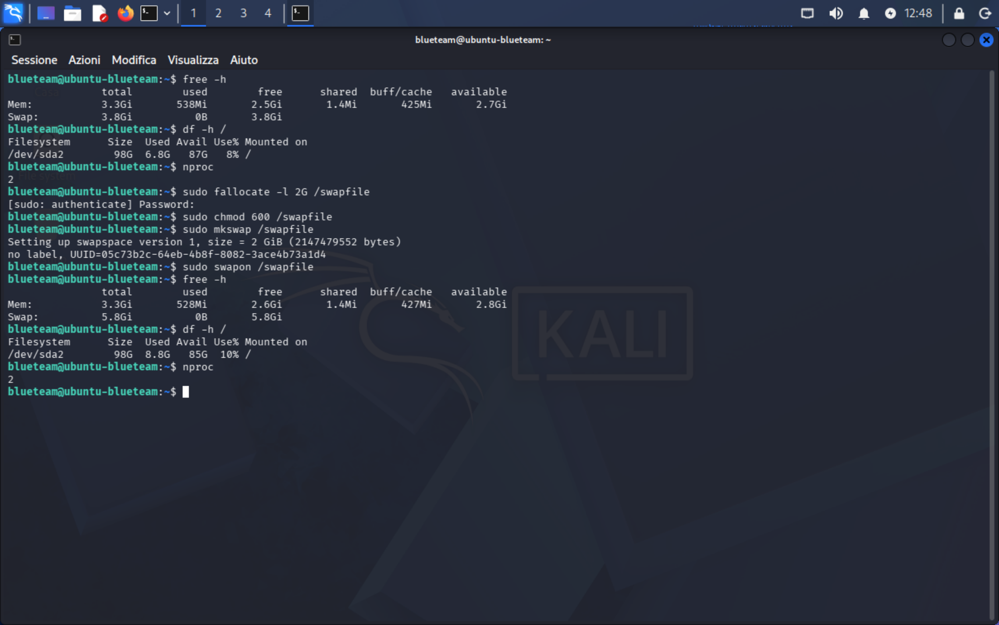
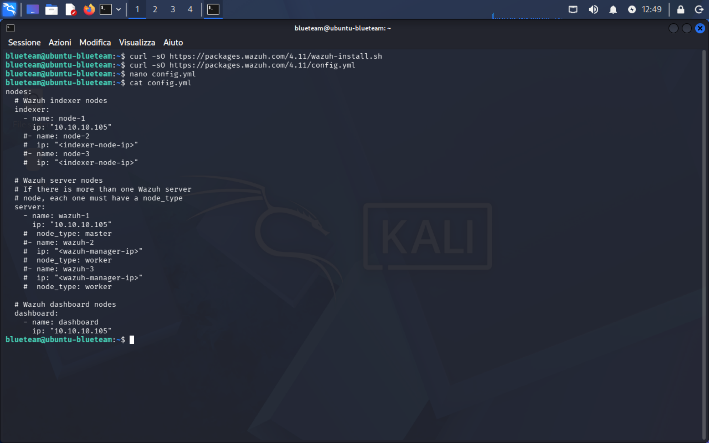
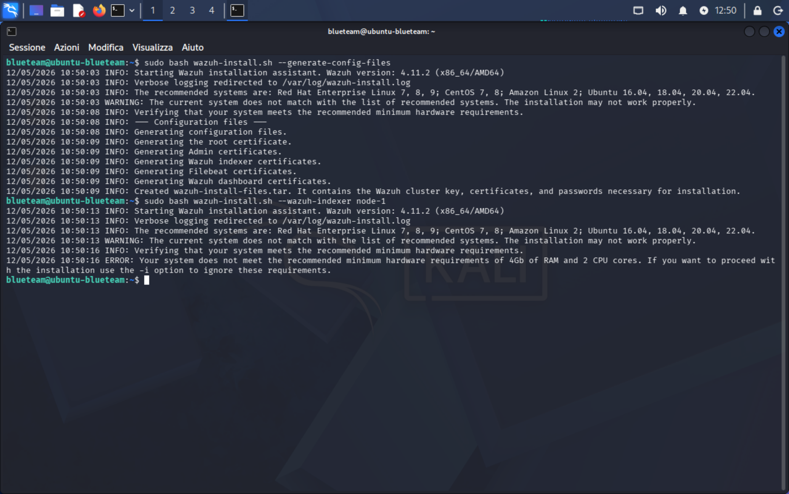
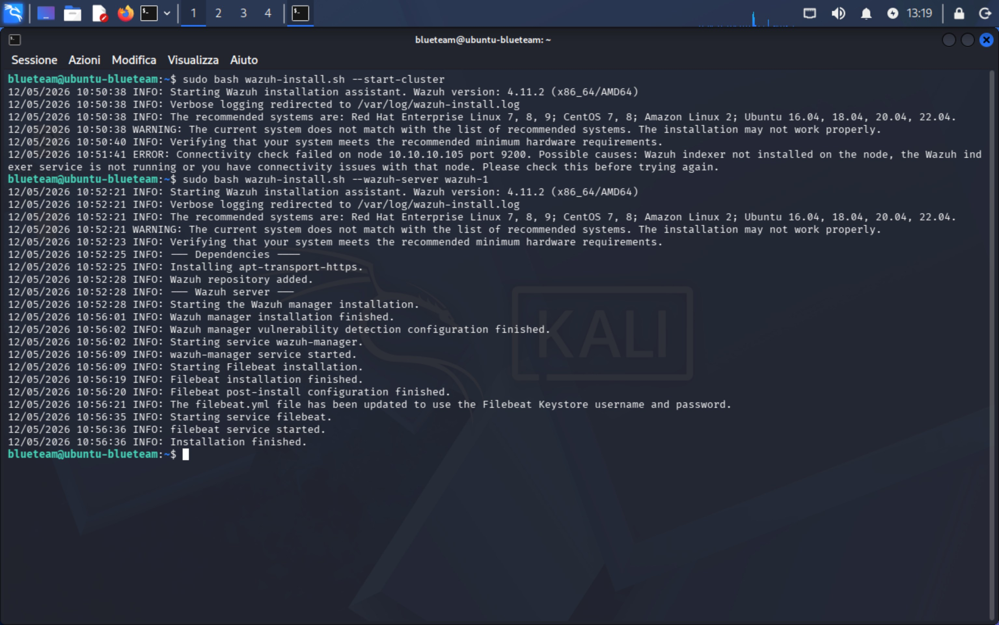
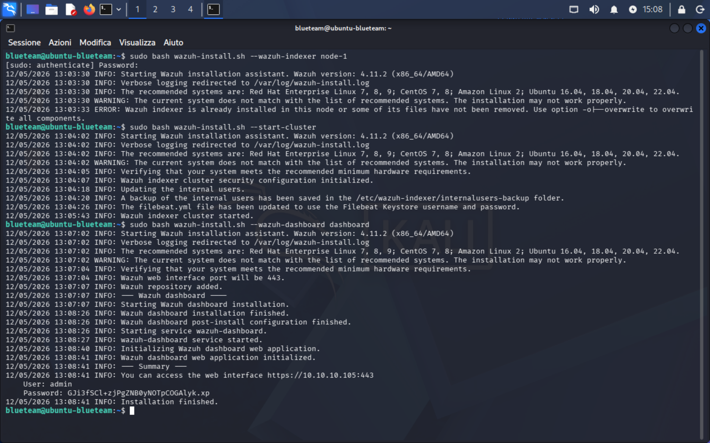
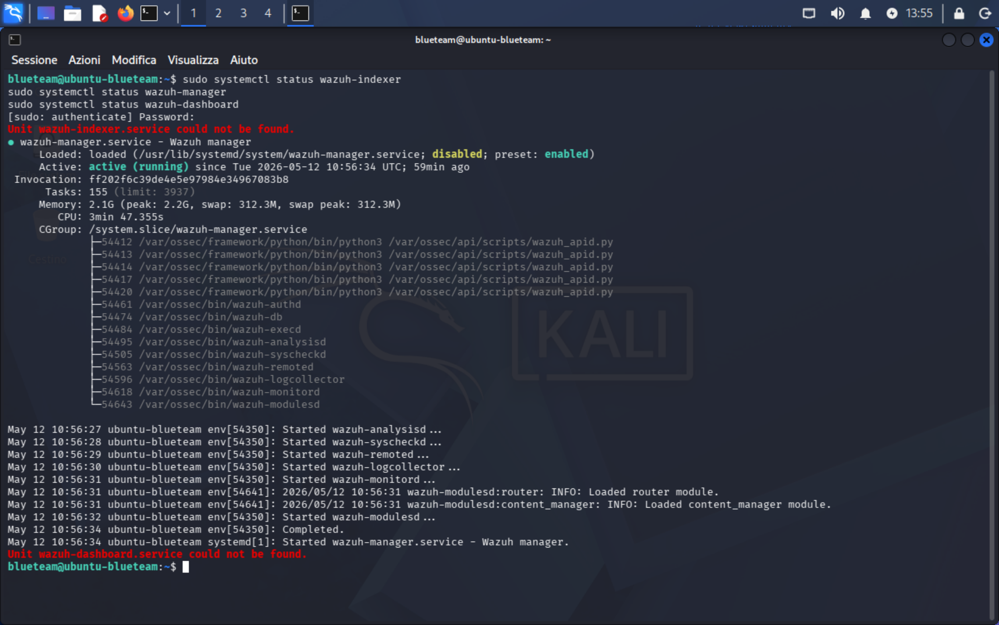
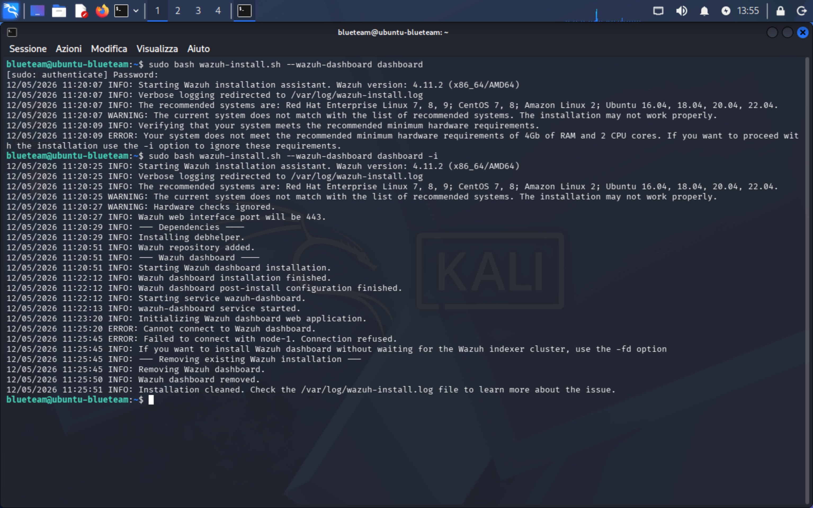
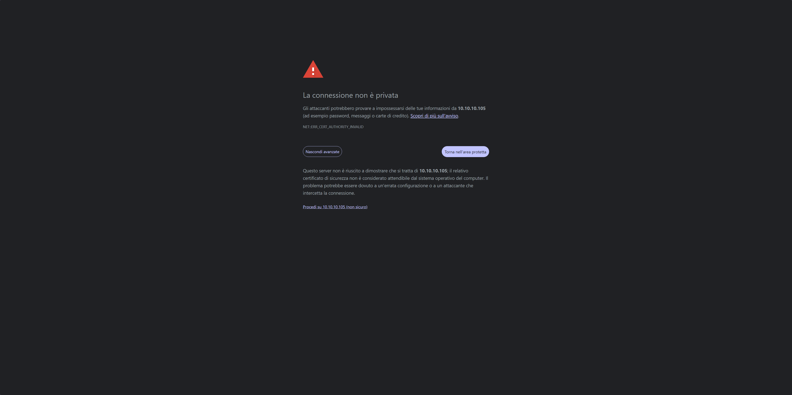
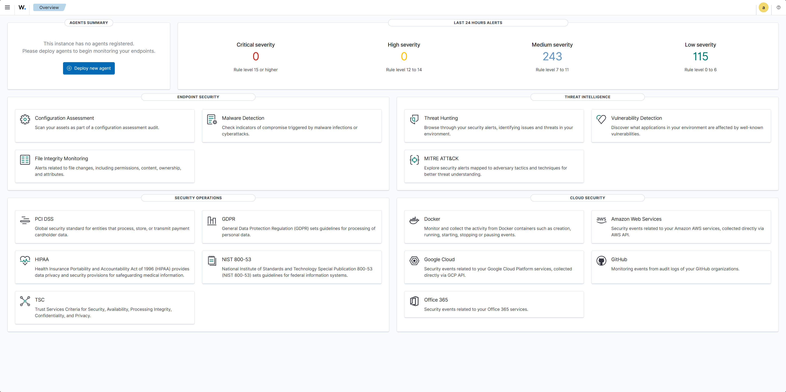

# 01 — Installazione Wazuh SIEM (Blue Team VM)

## Categoria
Blue Team / SIEM / Monitoring

## Obiettivo
Installare Wazuh 4.14.5-1 all-in-one su Ubuntu Server 10.10.10.105
come piattaforma SIEM per monitorare le attività di attacco nel lab.

## Ambiente

| Ruolo | VM | IP |
|---|---|---|
| SIEM | Ubuntu BlueTeam | 10.10.10.105 |

## Architettura Wazuh (single-node)

| Componente | Funzione |
|---|---|
| Wazuh Indexer | Database eventi (OpenSearch) — porta 9200 |
| Wazuh Manager | Raccoglie e analizza log dagli agent — porta 1514/1515 |
| Wazuh Dashboard | Interfaccia web — porta 443 |
| Filebeat | Forwarding log Manager → Indexer |

## Prerequisiti

```bash
free -h    # RAM disponibile
df -h /    # Spazio disco
nproc      # CPU cores
```

| Risorsa | Valore rilevato | Minimo richiesto |
|---|---|---|
| RAM | 3.3 GB (totale VM 4GB) | 4 GB |
| Disco libero | 87 GB | 50 GB ✅ |
| CPU | 2 core | 2 core ✅ |

**Problema:** La RAM totale disponibile (3.3 GB) era sotto la soglia
richiesta da Wazuh (4 GB). Risolto aggiungendo 2 GB di swap e
aumentando la VM a 6 GB in VMware.



### Fix — Aggiunta Swap

```bash
sudo fallocate -l 2G /swapfile
sudo chmod 600 /swapfile
sudo mkswap /swapfile
sudo swapon /swapfile
```

### Fix — Aumento RAM VM

Ubuntu spenta → VMware Edit VM Settings → Memory: 4096 MB → **6144 MB** → OK.

## Procedura di Installazione

### Step 1 — Download script e configurazione

```bash
curl -sO https://packages.wazuh.com/4.11/wazuh-install.sh
curl -sO https://packages.wazuh.com/4.11/config.yml
nano config.yml
```

Contenuto `config.yml`:

```yaml
nodes:
  indexer:
    - name: node-1
      ip: "10.10.10.105"
  server:
    - name: wazuh-1
      ip: "10.10.10.105"
  dashboard:
    - name: dashboard
      ip: "10.10.10.105"
```



### Step 2 — Generazione certificati

```bash
sudo bash wazuh-install.sh --generate-config-files
```

Output: certificati root, admin, indexer, filebeat, dashboard generati
in `wazuh-install-files.tar`. ✅



### Step 3 — Installazione Wazuh Indexer

```bash
sudo bash wazuh-install.sh --wazuh-indexer node-1
```

### Step 4 — Avvio Cluster

```bash
sudo bash wazuh-install.sh --start-cluster
```

Output: cluster security configuration initialized, internal users aggiornati,
filebeat.yml aggiornato, cluster started. ✅

### Step 5 — Installazione Wazuh Server

```bash
sudo bash wazuh-install.sh --wazuh-server wazuh-1
```

Output: wazuh-manager installed, wazuh-manager started, filebeat installed
e started. ✅



### Step 6 — Installazione Wazuh Dashboard

```bash
sudo bash wazuh-install.sh --wazuh-dashboard dashboard
```

Output finale:

```
INFO: You can access the web interface https://10.10.10.105:443
      User: admin
      Password: GJi3fSCl+zjPgZNB0yNOTpCOGAlyk.xp
INFO: Installation finished.
```



## Errori Incontrati

### Errore 1 — RAM insufficiente (primo tentativo)

```
ERROR: Your system does not meet the recommended minimum hardware
requirements of 4Gb of RAM and 2 CPU cores.
```

**Causa:** Ubuntu 26.04 su VM 4GB mostra solo 3.3GB di RAM disponibile
al sistema — sotto la soglia Wazuh.
**Soluzione:** VM aumentata a 6GB in VMware.

### Errore 2 — Dashboard connessione rifiutata (primo tentativo)

```
ERROR: Cannot connect to Wazuh dashboard.
ERROR: Failed to connect with node-1. Connection refused.
```

**Causa:** Il dashboard non trovava l'indexer perché l'indexer non era
ancora stato installato (bloccato dall'errore RAM precedente).
**Soluzione:** Installato prima l'indexer, poi rilanciato il dashboard.





## Verifica Servizi Post-Installazione

```bash
sudo systemctl status wazuh-indexer   # active (running) ✅
sudo systemctl status wazuh-manager   # active (running) ✅
sudo systemctl status wazuh-dashboard # active (running) ✅
```

## Accesso Dashboard

- **URL:** https://10.10.10.105 (porta 443)
- **Certificato:** self-signed — avviso browser normale in ambiente lab
- **User:** admin
- **Password:** salvata in password manager






## Stato Post-Installazione

| Voce             | Stato                                             |
| ---------------- | ------------------------------------------------- |
| Wazuh versione   | 4.14.5-1 ✅                                        |
| Indexer          | Running ✅                                         |
| Manager          | Running ✅                                         |
| Dashboard        | Running ✅                                         |
| Agent registrati | 0 — da configurare                                |
| Alert (24h)      | 243 Medium, 115 Low (generati dal sistema stesso) |

## Snapshot
- `03-ubuntu-wazuh-installato-dashboard-ok`

## Lezioni Imparate
- Ubuntu riporta meno RAM del totale VM — il kernel e i processi
  sistema occupano subito ~700MB; per Wazuh servono almeno 6GB VM
- Wazuh all-in-one installa 3 componenti separati che dipendono
  l'uno dall'altro: l'ordine di installazione è obbligatorio
  (indexer → cluster start → server → dashboard)
- Il warning "OS not in supported list" per Ubuntu 26.04 è ignorabile
  in lab — Wazuh funziona ugualmente
- Gli alert "Medium/Low" visibili subito nella dashboard sono generati
  dal sistema stesso (audit, login, file changes) — non da agent esterni
- La password admin viene mostrata UNA SOLA VOLTA a fine installazione:
  va copiata immediatamente in un password manager
