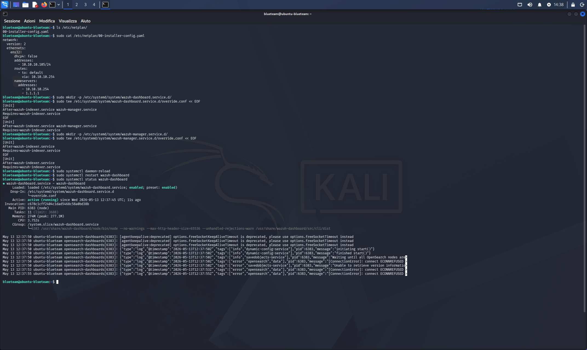

# 02 — Troubleshooting: Wazuh Non Raggiungibile Post-Reboot

## Categoria
Blue Team / SIEM / Troubleshooting / Configurazione

## Obiettivo
Diagnosticare e risolvere il problema che rendeva la dashboard Wazuh
irraggiungibile dopo ogni riavvio di Ubuntu-BlueTeam.

## Ambiente

| Ruolo | VM | IP |
|---|---|---|
| SIEM | Ubuntu BlueTeam | 10.10.10.105 |

## Sintomo Iniziale

Al riavvio della VM, aprendo `https://10.10.10.105` dal browser:
```
Wazuh dashboard server is not ready yet
```

I servizi risultavano in stati incoerenti:
- `wazuh-manager` → inactive (dead)
- `wazuh-dashboard` → active ma con errori continui
- `wazuh-indexer` → active ma porta 9200 non raggiungibile

---

## Diagnostica Completa

### BLOCCO 1 — Sistema Base

```bash
uname -a
lsb_release -a
uptime
free -h
df -h
nproc
lscpu | grep -E "Model name|CPU\(s\)|Thread"
```

| Risorsa | Valore |
|---|---|
| OS | Ubuntu 26.04 LTS, kernel 7.0.0-15-generic |
| RAM totale | 5.2 GB |
| RAM usata | 2.5 GB |
| Swap | 5.8 GB (attivo) |
| Disco libero | 71 GB / 98 GB |
| CPU | 2 core, AMD Ryzen 9 9900X |


### BLOCCO 2 — Rete

```bash
ip addr show
ip route show
ping 10.10.10.254 -c 2
ping 8.8.8.8 -c 2
ping google.com -c 2
sudo ss -tlnp
```

Risultati:
- IP: `10.10.10.105/24` su ens32 ✅
- Gateway: `10.10.10.254` (proto static) ✅
- Internet: funzionante ✅
- Porte aperte: 1514, 1515, 55000 (manager), 443 (dashboard), 9200 (indexer)

**Nota critica sul binding della porta 9200:**
```
[::ffff:10.10.10.105]:9200  →  java (wazuh-indexer)
```
L'indexer ascolta su `10.10.10.105:9200`, **non** su `127.0.0.1:9200`.


### BLOCCO 3 — Stato Servizi

```bash
sudo systemctl status wazuh-indexer --no-pager
sudo systemctl status wazuh-manager --no-pager
sudo systemctl status wazuh-dashboard --no-pager
sudo systemctl is-enabled wazuh-indexer
sudo systemctl is-enabled wazuh-manager
sudo systemctl is-enabled wazuh-dashboard
```

| Servizio | Stato | Enabled |
|---|---|---|
| wazuh-indexer | active (running) | enabled ✅ |
| wazuh-manager | active (running) | enabled ✅ |
| wazuh-dashboard | active (running, errori) | enabled ✅ |

**Log critici del dashboard:**
```
[ConnectionError]: connect ECONNREFUSED 127.0.0.1:9200
[ConnectionError]: connect ECONNREFUSED 127.0.0.1:9200
```

Il dashboard tenta di connettersi a `127.0.0.1:9200`
ma l'indexer non ascolta su quell'indirizzo.


### BLOCCO 4 — Netplan e Rete

```bash
ls /etc/netplan/
cat /etc/netplan/00-installer-config.yaml
networkctl status
```

**Scoperta:** Il file Netplan ha nome `00-installer-config.yaml`,
non `50-cloud-init.yaml` come documentato precedentemente.
La configurazione è comunque corretta:

```yaml
network:
  version: 2
  ethernets:
    ens32:
      dhcp4: false
      addresses:
        - 10.10.10.105/24
      routes:
        - to: default
          via: 10.10.10.254
      nameservers:
        addresses:
          - 10.10.10.254
          - 1.1.1.1
```


### BLOCCO 5 — Configurazione OpenSearch e Versioni

```bash
sudo cat /etc/wazuh-indexer/opensearch.yml
dpkg -l | grep wazuh
```

Da `opensearch.yml`:
```yaml
network.host: 10.10.10.105
```

Versioni pacchetti installati (reali, diverse da quanto indicato
dall'installer script):

| Pacchetto | Versione |
|---|---|
| wazuh-dashboard | 4.14.5-1 |
| wazuh-indexer | 4.14.5-1 |
| wazuh-manager | 4.14.5-1 |

**Nota:** L'installer script riportava "Wazuh version: 4.11.2"
ma i pacchetti effettivamente installati sono 4.14.5-1.
Ubuntu 26.04 non è nella lista OS supportati ufficialmente —
il comportamento è comunque corretto.


---

## Root Cause Analysis

### Test curl decisivo

```bash
# FALLITO — indexer non ascolta qui
sudo curl -sk -u admin:[PASSWORD] https://127.0.0.1:9200
# (nessun output)

# SUCCESSO — indexer raggiungibile qui
sudo curl -sk -u admin:[PASSWORD] https://10.10.10.105:9200
# {"name":"node-1","cluster_name":"wazuh-indexer-cluster",...}

# FALLITO — IPv6 loopback non configurato
sudo curl -sk -u admin:[PASSWORD] https://[::1]:9200
# (nessun output)
```

### Configurazione dashboard errata

```bash
sudo grep -E "opensearch.hosts|opensearch.ssl" \
  /etc/wazuh-dashboard/opensearch_dashboards.yml
```

Output:
```
opensearch.hosts: https://localhost:9200       ← PROBLEMA
opensearch.ssl.verificationMode: certificate
opensearch.ssl.certificateAuthorities: ["/etc/wazuh-dashboard/certs/root-ca.pem"]
```

### Schema del problema

```
Dashboard cerca:   https://localhost:9200  (= 127.0.0.1:9200)
                          ↓
                     ECONNREFUSED

Indexer ascolta:   https://10.10.10.105:9200
                          ↓
                     FUNZIONA
```

**Causa:** L'installer Wazuh ha generato la configurazione del dashboard
con `opensearch.hosts: https://localhost:9200` ma l'indexer è configurato
con `network.host: 10.10.10.105` e non ascolta su localhost.
Su sistemi ufficialmente supportati l'installer allinea i due valori
automaticamente. Su Ubuntu 26.04 (non supportato) questo non avviene.

```bash
# Verifica IPv6 binding (escluso come causa)
sysctl net.ipv6.bindv6only
# net.ipv6.bindv6only = 0  ← non è il problema
```


---

## Fix Applicati

### Fix 1 — Swap permanente (perso al reboot)

Lo swap non persisteva al riavvio perché non era in `/etc/fstab`.

```bash
# Riattivazione manuale (solo per questa sessione)
sudo swapon /swapfile

# Rendi permanente (una volta sola)
echo '/swapfile none swap sw 0 0' | sudo tee -a /etc/fstab
```

### Fix 2 — Ordine avvio servizi (systemd override)

Al boot i 3 servizi Wazuh si avviano in parallelo. Il dashboard
partiva prima che l'indexer (Java/OpenSearch) fosse pronto,
generando errori di connessione.

```bash
# Override dashboard: aspetta indexer e manager
sudo mkdir -p /etc/systemd/system/wazuh-dashboard.service.d/
sudo tee /etc/systemd/system/wazuh-dashboard.service.d/override.conf << EOF
[Unit]
After=wazuh-indexer.service wazuh-manager.service
Requires=wazuh-indexer.service
EOF

# Override manager: aspetta indexer
sudo mkdir -p /etc/systemd/system/wazuh-manager.service.d/
sudo tee /etc/systemd/system/wazuh-manager.service.d/override.conf << EOF
[Unit]
After=wazuh-indexer.service
Requires=wazuh-indexer.service
EOF

sudo systemctl daemon-reload
```



### Fix 3 — opensearch.hosts (causa principale)

```bash
# Modifica: localhost → 10.10.10.105
sudo sed -i \
  's|opensearch.hosts: https://localhost:9200|opensearch.hosts: https://10.10.10.105:9200|' \
  /etc/wazuh-dashboard/opensearch_dashboards.yml

# Verifica
grep "opensearch.hosts" /etc/wazuh-dashboard/opensearch_dashboards.yml
# opensearch.hosts: https://10.10.10.105:9200  ✅

# Riavvio dashboard
sudo systemctl restart wazuh-dashboard
```

**Risultato:** Dashboard raggiungibile su `https://10.10.10.105` ✅

---

## Stato Post-Fix

```bash
sudo systemctl status wazuh-indexer   # active (running) ✅
sudo systemctl status wazuh-manager   # active (running) ✅
sudo systemctl status wazuh-dashboard # active (running) ✅
```

| Voce | Stato |
|---|---|
| Dashboard web | Raggiungibile ✅ |
| opensearch.hosts | https://10.10.10.105:9200 ✅ |
| Swap permanente | /etc/fstab ✅ |
| Startup ordering | systemd override ✅ |
| Netplan file reale | 00-installer-config.yaml ✅ |

## Correzioni alla Documentazione

Da aggiornare in `06-ubuntu-server-installazione.md`:
- Nome file Netplan: `00-installer-config.yaml` (non `50-cloud-init.yaml`)
- RAM VM: `6144 MB` (aumentata da 4096 MB per requisiti Wazuh)

Da aggiornare in `01-wazuh-installazione.md`:
- Versione pacchetti reale: `4.14.5-1` (non 4.11.2 come da installer script)

## Snapshot
- `04-ubuntu-wazuh-post-troubleshooting-ok`

## Lezioni Imparate

- Wazuh su OS non supportato (Ubuntu 26.04) genera configurazioni
  disallineate: `opensearch.hosts` nel dashboard punta a `localhost`
  mentre l'indexer ascolta sull'IP specifico della VM
- Lo swap creato manualmente (`swapon`) non persiste al reboot senza
  una entry in `/etc/fstab` — verificare sempre dopo ogni creazione
- I 3 componenti Wazuh (indexer, manager, dashboard) hanno dipendenze
  di avvio: l'indexer (OpenSearch/Java) impiega 2-5 minuti per
  inizializzare; senza systemd ordering il dashboard parte troppo presto
- `ss -tlnp` è fondamentale per vedere l'indirizzo ESATTO su cui
  un processo è in ascolto — `[::]` e `[::ffff:IP]` si comportano
  diversamente per le connessioni in entrata
- Il comando `curl -sk` verso l'IP specifico (non localhost) è il
  test definitivo per verificare se un servizio HTTPS risponde davvero
- Ubuntu 26.04 salva la configurazione Netplan in
  `00-installer-config.yaml`, non in `50-cloud-init.yaml`
