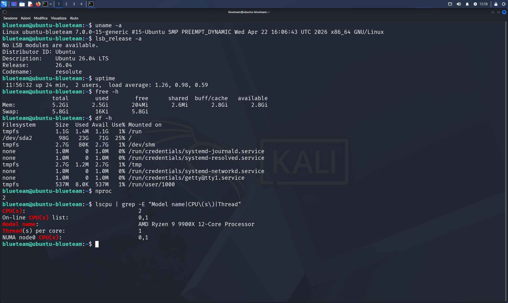
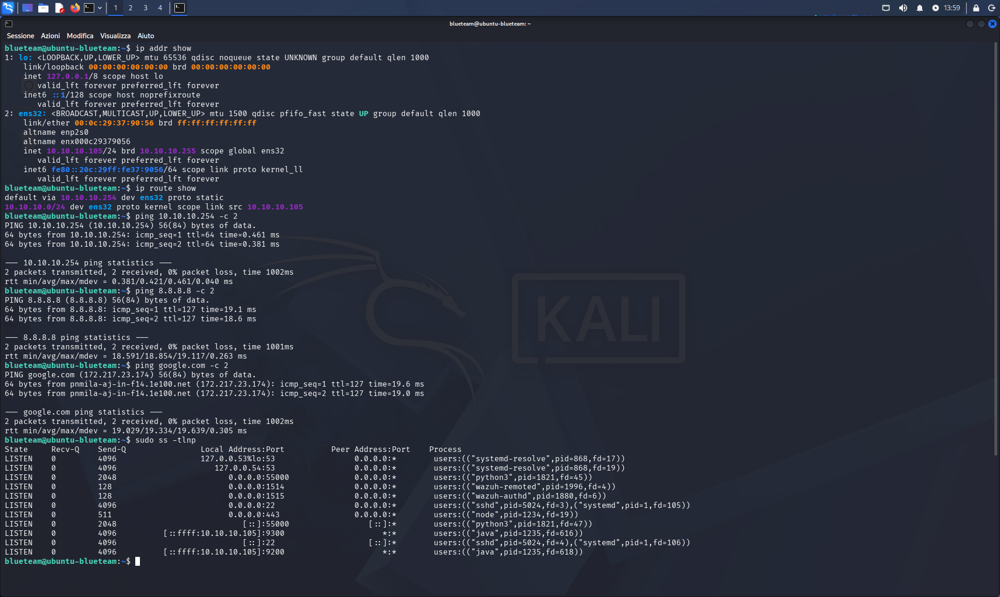
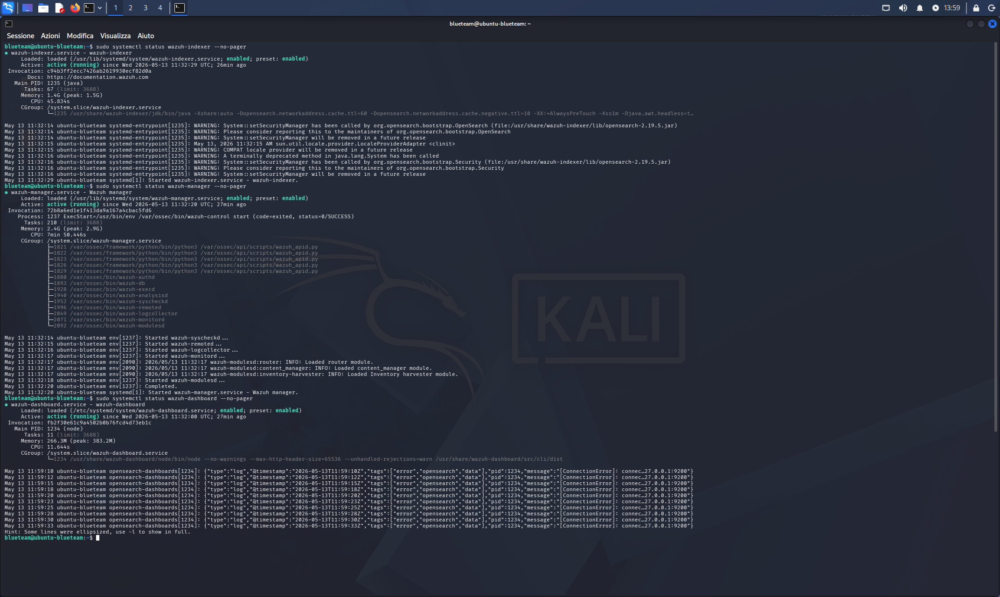
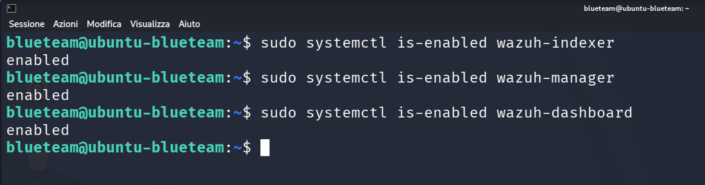
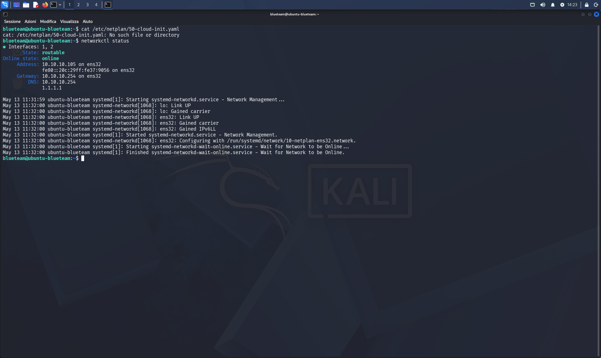
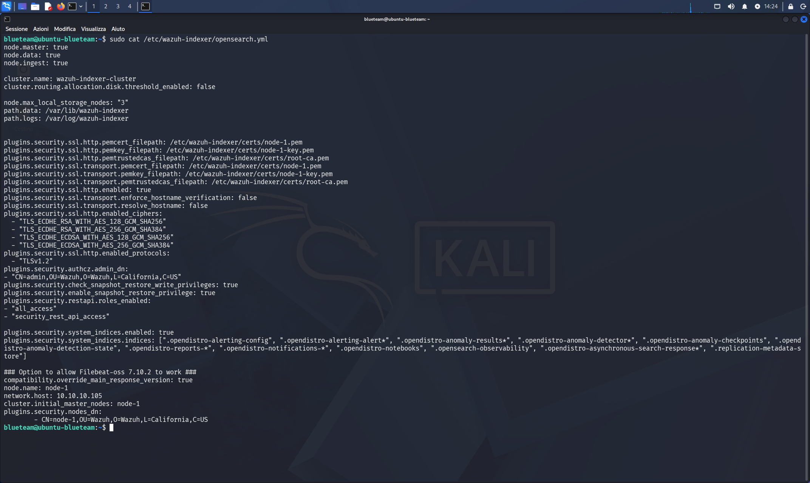
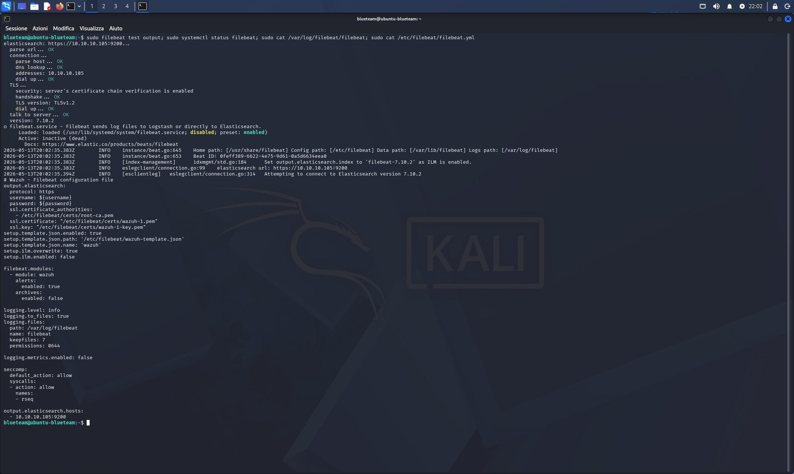
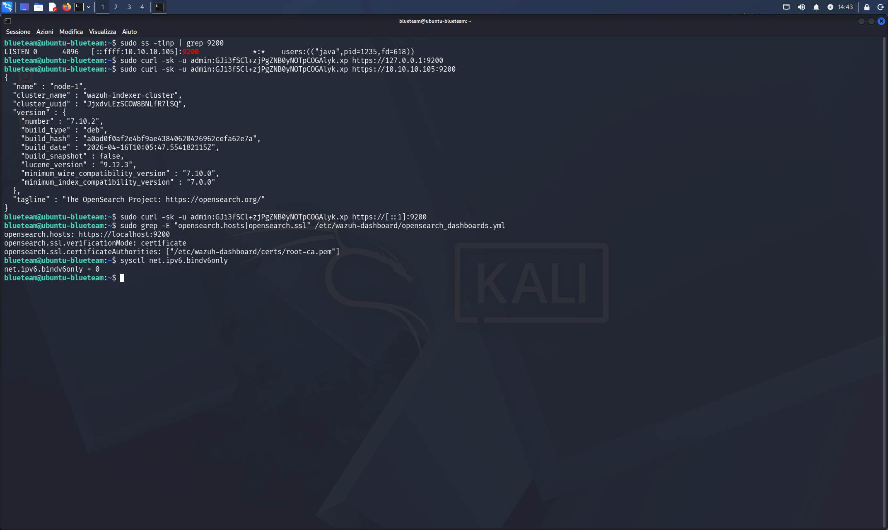
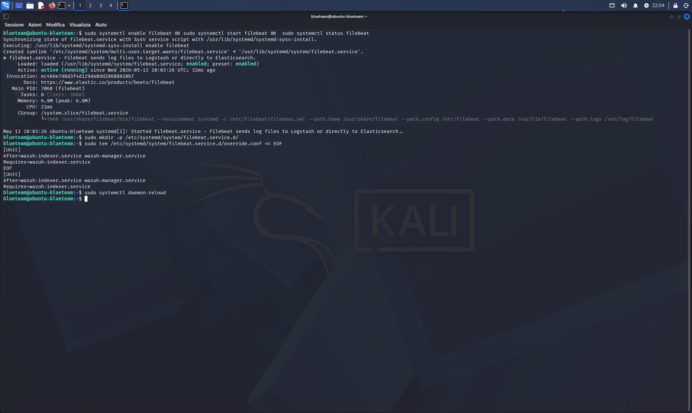

# 02 — Troubleshooting: Wazuh Non Raggiungibile Post-Reboot

## Categoria
Blue Team / SIEM / Troubleshooting / Configurazione

## Obiettivo
Diagnosticare e risolvere i problemi che rendevano la dashboard Wazuh
irraggiungibile dopo ogni riavvio, e che impedivano la visualizzazione
degli eventi degli agent nella dashboard.

## Ambiente

| Ruolo | VM | IP |
|---|---|---|
| SIEM | Ubuntu BlueTeam | 10.10.10.105 |

## Sintomi

**Sintomo 1** — Al riavvio della VM:
```
Wazuh dashboard server is not ready yet
```

**Sintomo 2** — Con agent Kali attivo ma nessun evento visibile:
```
No results match your search criteria
```

---

## Diagnostica Completa

### BLOCCO 1 — Sistema Base

```bash
uname -a && lsb_release -a && uptime && free -h && df -h && nproc
lscpu | grep -E "Model name|CPU\(s\)|Thread"
```

| Risorsa | Valore |
|---|---|
| OS | Ubuntu 26.04 LTS, kernel 7.0.0-15-generic |
| RAM totale | 5.2 GB |
| Swap | 5.8 GB (attivo) |
| Disco libero | 71 GB / 98 GB |
| CPU | 2 core, AMD Ryzen 9 9900X |



### BLOCCO 2 — Rete e Porte

```bash
ip addr show && ip route show
ping 10.10.10.254 -c 2 && ping 8.8.8.8 -c 2
sudo ss -tlnp
```

**Nota critica — binding porta 9200:**
```
[::ffff:10.10.10.105]:9200  →  java (wazuh-indexer)
```
L'indexer ascolta su `10.10.10.105:9200`, **non** su `127.0.0.1:9200`.



### BLOCCO 3 — Stato Servizi

```bash
sudo systemctl status wazuh-{indexer,manager,dashboard} --no-pager
sudo systemctl is-enabled wazuh-{indexer,manager,dashboard}
```

**Log critici del dashboard:**
```
[ConnectionError]: connect ECONNREFUSED 127.0.0.1:9200
```




### BLOCCO 4 — Netplan

```bash
ls /etc/netplan/
# → 00-installer-config.yaml  (non 50-cloud-init.yaml come documentato)
networkctl status
```



### BLOCCO 5 — Configurazione OpenSearch e versioni

```bash
sudo cat /etc/wazuh-indexer/opensearch.yml
# → network.host: 10.10.10.105
dpkg -l | grep wazuh
# → wazuh-dashboard/indexer/manager: 4.14.5-1
```



### BLOCCO 6 — Filebeat

```bash
sudo filebeat test output     # → OK (connettività funziona)
sudo systemctl status filebeat # → inactive (dead) — disabled ← BUG
sudo cat /etc/filebeat/filebeat.yml
# output.elasticsearch.hosts: 10.10.10.105:9200 ← configurazione corretta
```



---

## Root Cause Analysis

### Bug 1 — Dashboard cerca indexer su localhost (sintomo 1)

```bash
sudo curl -sk -u admin:[PASS] https://127.0.0.1:9200   # FALLITO
sudo curl -sk -u admin:[PASS] https://10.10.10.105:9200 # SUCCESSO

grep "opensearch.hosts" /etc/wazuh-dashboard/opensearch_dashboards.yml
# opensearch.hosts: https://localhost:9200  ← ERRATO
```

L'installer Wazuh su Ubuntu 26.04 (OS non supportato) configura
il dashboard per connettersi a `localhost:9200` ma l'indexer
ascolta su `10.10.10.105:9200`.



### Bug 2 — Filebeat non avviato (sintomo 2)

Filebeat è il bridge tra Manager e Indexer.
Era installato ma `disabled` e `inactive (dead)`.

```
Agent Kali → Manager (riceve) → Filebeat (SPENTO) → Indexer (vuoto)
                                                          ↓
                                              Dashboard: "No results"
```

### Bug 3 — Startup ordering al boot

I servizi si avviano in parallelo. Il dashboard partiva prima
che l'indexer (OpenSearch/Java, 3-5 min di init) fosse pronto.

---

## Fix Applicati

### Fix 1 — Swap permanente

```bash
sudo swapon /swapfile
echo '/swapfile none swap sw 0 0' | sudo tee -a /etc/fstab
```

### Fix 2 — opensearch.hosts (sintomo 1)

```bash
sudo sed -i \
  's|opensearch.hosts: https://localhost:9200|opensearch.hosts: https://10.10.10.105:9200|' \
  /etc/wazuh-dashboard/opensearch_dashboards.yml
sudo systemctl restart wazuh-dashboard
```

### Fix 3 — Startup ordering

```bash
sudo mkdir -p /etc/systemd/system/wazuh-dashboard.service.d/
sudo tee /etc/systemd/system/wazuh-dashboard.service.d/override.conf << EOF
[Unit]
After=wazuh-indexer.service wazuh-manager.service
Requires=wazuh-indexer.service
EOF

sudo mkdir -p /etc/systemd/system/wazuh-manager.service.d/
sudo tee /etc/systemd/system/wazuh-manager.service.d/override.conf << EOF
[Unit]
After=wazuh-indexer.service
Requires=wazuh-indexer.service
EOF

sudo systemctl daemon-reload
```

### Fix 4 — Filebeat abilitato (sintomo 2)

```bash
sudo systemctl enable filebeat
sudo systemctl start filebeat
# Active: active (running) ✅

sudo mkdir -p /etc/systemd/system/filebeat.service.d/
sudo tee /etc/systemd/system/filebeat.service.d/override.conf << EOF
[Unit]
After=wazuh-indexer.service wazuh-manager.service
Requires=wazuh-indexer.service
EOF

sudo systemctl daemon-reload
```



---

## Stato Post-Fix

| Servizio | Stato | Enabled | Fix |
|---|---|---|---|
| wazuh-indexer | ✅ running | ✅ | — |
| wazuh-manager | ✅ running | ✅ | Fix 3 |
| wazuh-dashboard | ✅ running | ✅ | Fix 2 + Fix 3 |
| filebeat | ✅ running | ✅ | Fix 4 |

**Risultato:** Dashboard raggiungibile, 213 eventi da kali-attacker
visibili nella sezione Threat Hunting. ✅

## Snapshot
- `05-ubuntu-filebeat-attivo-alert-ok`

## Lezioni Imparate
- Wazuh ha 4 componenti critici: indexer, manager, dashboard,
  **filebeat** — se uno è spento il sistema è parzialmente cieco
- Filebeat è il bridge Manager → Indexer: senza di esso gli eventi
  arrivano al Manager ma non appaiono mai nella dashboard
- `filebeat test output` verifica solo la connettività, non se il
  servizio è in esecuzione — controllare sempre anche `systemctl status`
- `systemctl is-enabled` ≠ `systemctl status`: un servizio può essere
  enabled ma dead, o running ma disabled
- Su Ubuntu 26.04 (non supportato da Wazuh), l'installer genera
  configurazioni parzialmente errate che richiedono fix manuali
- Aggiungere tutti i servizi dipendenti agli override systemd evita
  race condition al boot
