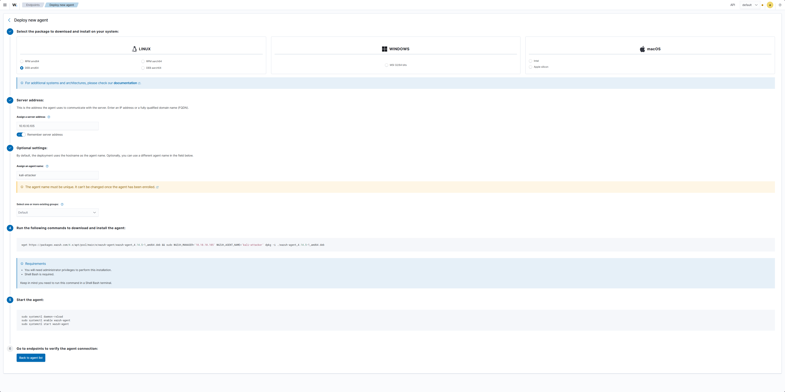
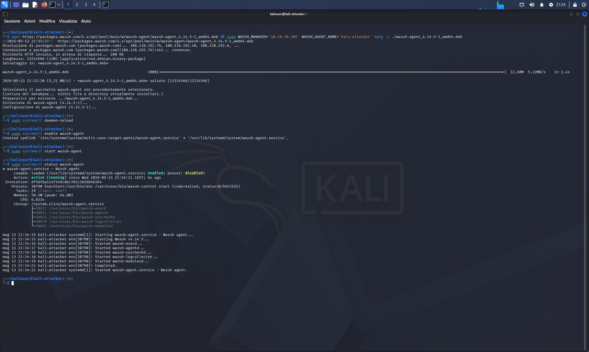
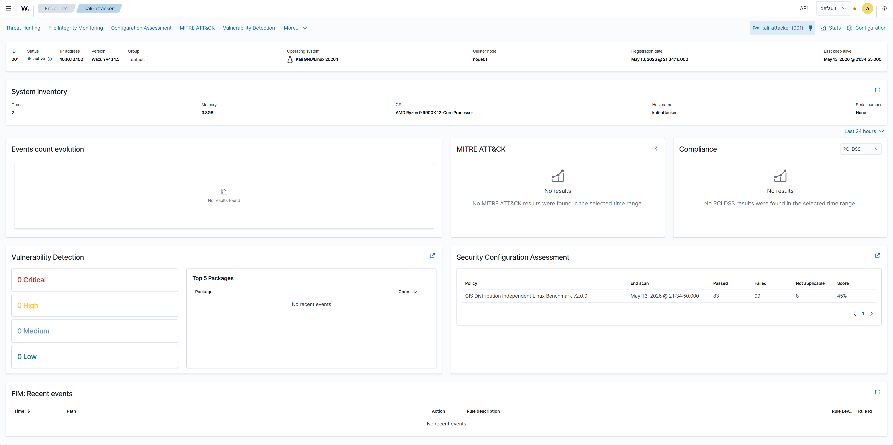

# 03 — Wazuh Agent on Kali (Attacker VM)

## Category
Blue Team / SIEM / Agent / Monitoring

## Objective
Install the Wazuh Agent on Kali Linux (10.10.10.100) and register it
to the Manager on Ubuntu (10.10.10.105). From this point Wazuh monitors
in real time everything happening on the attacker machine.

## Environment

| Role | VM | IP |
|---|---|---|
| SIEM / Manager | Ubuntu BlueTeam | 10.10.10.105 |
| Attacker / Agent | Kali Linux | 10.10.10.100 |

## Post-Installation Architecture

```
Kali (10.10.10.100)              Ubuntu (10.10.10.105)
┌──────────────────┐             ┌────────────────────────┐
│  Wazuh Agent     │────────────▶│  Wazuh Manager         │
│  v4.14.5         │  port 1514  │  collects logs/events  │
│  active/running  │             │                        │
└──────────────────┘             │  Dashboard: alerts ✅  │
                                 └────────────────────────┘
```

## Procedure

### Step 1 — Generate command from Dashboard

Wazuh Dashboard (`https://10.10.10.105`) →
**Deploy new agent** → form filled:

| Field | Value |
|---|---|
| OS | Linux — DEB amd64 |
| Server address | 10.10.10.105 |
| Agent name | kali-attacker |
| Group | default |

Dashboard automatically generates the installation command.



### Step 2 — Installation on Kali

Generated command executed on Kali:

```bash
wget https://packages.wazuh.com/4.x/apt/pool/main/w/wazuh-agent/wazuh-agent_4.14.5-1_amd64.deb \
  && sudo WAZUH_MANAGER='10.10.10.105' \
     WAZUH_AGENT_NAME='kali-attacker' \
     dpkg -i ./wazuh-agent_4.14.5-1_amd64.deb
```

Output:
```
wazuh-agent_4.14.5-1_amd64.deb  100% [====] 12,60M 5,22MB/s in 2,4s
Selecting previously unselected package wazuh-agent.
Setting up wazuh-agent (4.14.5-1)...
```

### Step 3 — Start and enable service

```bash
sudo systemctl daemon-reload
sudo systemctl enable wazuh-agent
sudo systemctl start wazuh-agent
sudo systemctl status wazuh-agent
```

Status output:
```
● wazuh-agent.service - Wazuh agent
   Loaded: loaded (/usr/lib/systemd/system/wazuh-agent.service; enabled)
   Active: active (running) since Wed 2026-05-13 21:34:21 CEST; 6s ago

Active processes:
├─ wazuh-execd
├─ wazuh-agentd
├─ wazuh-syscheckd
├─ wazuh-logcollector
└─ wazuh-modulesd
```



## Dashboard Verification

After ~30 seconds from agent startup, in Dashboard:
**Endpoints → kali-attacker → active** ✅

| Field | Value |
|---|---|
| ID | 001 |
| Status | active |
| IP | 10.10.10.100 |
| Version | Wazuh v4.14.5 |
| OS | Kali GNU/Linux 2026.1 |
| Cluster node | node01 |
| Registration | May 13, 2026 @ 21:34:16 |



## Initial Automatic Analysis

Wazuh automatically performed a **Security Configuration
Assessment (SCA)** on Kali using the
**CIS Distribution Independent Linux v2.0.0** benchmark:

| Metric | Value |
|---|---|
| Passed | 83 |
| Failed | 99 |
| Not applicable | 8 |
| Score | 45% |

This is normal for an attacker machine — Kali is not designed
to be hardened but to perform penetration testing.
Low score is not a problem in this lab context.

## Snapshot
- `06-kali-wazuh-agent-attivo`

## Lessons Learned
- Agent installation command already includes `WAZUH_MANAGER`
  and `WAZUH_AGENT_NAME` variables — no manual post-install configuration needed
- Agent automatically registers to Manager as soon as the
  service starts — no manual approval required
- SCA runs automatically a few seconds after registration —
  Wazuh starts collecting data immediately
- Low SCA score on Kali is expected: it is an offensive distro,
  not a production server to harden
- From this point Wazuh sees all processes, connections
  and file changes occurring on Kali in real time
