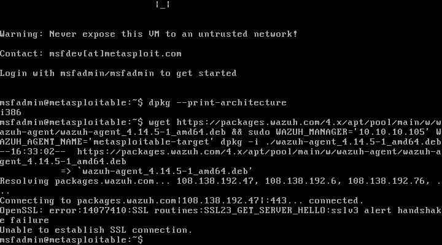

# 05 — Wazuh Agent on Metasploitable2 — Failed Attempt

## Category
Blue Team / SIEM / Agent / Compatibility / Legacy Systems

## Objective
Attempt Wazuh Agent installation on Metasploitable2 to
monitor the target VM from the victim's perspective during
exploits. Document the outcome and technical causes of failure.

## Environment

| Role | VM | IP |
|---|---|---|
| SIEM | Ubuntu BlueTeam | 10.10.10.105 |
| Target | Metasploitable2 | 10.10.10.101 |

## Metasploitable2 Specs

| Parameter | Value |
|---|---|
| OS | Ubuntu 8.04 LTS (Hardy Heron) — 2008 |
| Kernel | 2.6.24-16-server |
| Architecture | i686 / i386 (32-bit) |
| OpenSSL | 0.9.8g (2007) |
| glibc | 2.7 |
| Purpose | Intentionally vulnerable VM for penetration testing |

## VM Access

Metasploitable2 has no GUI — text console only.
Credentials: `msfadmin / msfadmin`

**SSH Note:** Meta has SSH on port 22 but uses deprecated
key exchange algorithms. From a modern Kali they must be forced:

```bash
ssh -o KexAlgorithms=+diffie-hellman-group1-sha1 \
    -o HostKeyAlgorithms=+ssh-rsa \
    msfadmin@10.10.10.101
```

For this attempt the VMware console was used directly.

## Attempted Procedure

### Step 1 — Architecture verification

```bash
dpkg --print-architecture
# i386
```

Confirmed: 32-bit system, requires `i386` package.

### Step 2 — Command generated by Dashboard

Wazuh Dashboard generated command for `amd64` (error):

```bash
wget https://packages.wazuh.com/4.x/apt/pool/main/w/wazuh-agent/\
wazuh-agent_4.14.5-1_amd64.deb \
&& sudo WAZUH_MANAGER='10.10.10.105' \
   WAZUH_AGENT_NAME='metasploitable-target' \
   dpkg -i ./wazuh-agent_4.14.5-1_amd64.deb
```

### Step 3 — Error during download

```
Resolving packages.wazuh.com... 108.138.192.47, ...
Connecting to packages.wazuh.com|108.138.192.47|:443... connected.
OpenSSL: error:14077410:SSL routines:SSL23_GET_SERVER_HELLO:sslv3 alert handshake failure
Unable to establish SSL connection.
```

Download fails before even reaching the package.



## Analysis — Causes of Failure

### Cause 1 — OpenSSL too old (blocking)

| System | OpenSSL Version | Supported TLS |
|---|---|---|
| Metasploitable2 | 0.9.8g (2007) | SSLv3, TLS 1.0 |
| packages.wazuh.com | Modern | TLS 1.2+ mandatory |

Wazuh server requires minimum TLS 1.2. OpenSSL 0.9.8 does not
support it → handshake fails → download impossible.

### Cause 2 — Wrong architecture in command

Dashboard generated command for `amd64` but system
is `i386`. Even correcting package to `i386`, the TLS
problem would still block the download.

### Cause 3 — Incompatible system dependencies (blocking)

Even downloading the package via alternative method
(e.g. SCP transfer from Kali), installation would fail:

| Dependency | Required by Wazuh | Available on Ubuntu 8.04 |
|---|---|---|
| glibc | ≥ 2.17 | 2.7 ❌ |
| OpenSSL | ≥ 1.0.2 | 0.9.8 ❌ |
| systemd | required | not present (uses SysV init) ❌ |

Metasploitable2 is based on Ubuntu 8.04 from 2008 — it is
fundamentally incompatible with any modern software.

## Outcome

| Attempt | Result |
|---|---|
| Package download | ❌ SSL handshake failure |
| dpkg installation | ❌ not reached |
| Agent registered on Wazuh | ❌ impossible |

**Conclusion:** Wazuh Agent installation on Metasploitable2
is technically impossible with Wazuh 4.x. No version
of Wazuh Agent is compatible with Ubuntu 8.04 / glibc 2.7.

## Alternative for Monitoring the Victim

In a more advanced lab, a modern target VM would be used
(e.g. Metasploitable3, based on Ubuntu 14.04/Windows Server)
that supports modern agents. Alternatively:

- **Wireshark on Kali**: captures network traffic of the attack
- **tcpdump on Kali**: command-line traffic analysis
- **pfSense logs**: firewall sees all traffic between VMs

## Snapshot
None — no persistent changes to the VM.

## Lessons Learned
- Metasploitable2 is intentionally old and vulnerable —
  this same characteristic makes it incompatible with
  modern security software like Wazuh
- Wazuh Dashboard generates package for architecture
  selected in the form — always select `i386` for 32-bit
  systems, not `amd64`
- OpenSSL 0.9.8 (2007) does not support TLS 1.2: any modern
  HTTPS connection fails — this is exactly the type of
  vulnerability that makes Metasploitable2 an easy target
- In the real world legacy systems are a huge risk:
  they cannot be monitored by modern agents but are
  equally exposed to attacks
- SIEM coverage always has "blind spots" on systems
  too old — Blue Team must be aware of this
