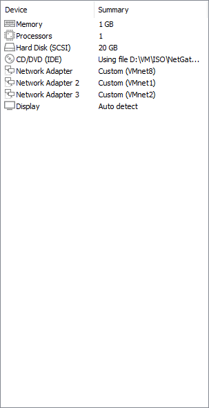
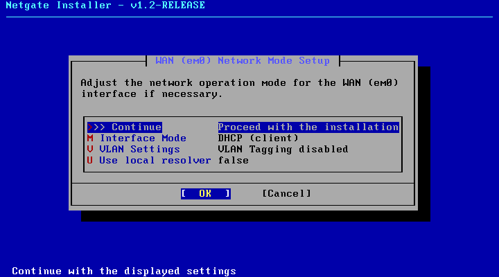
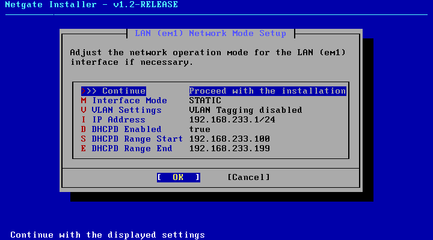
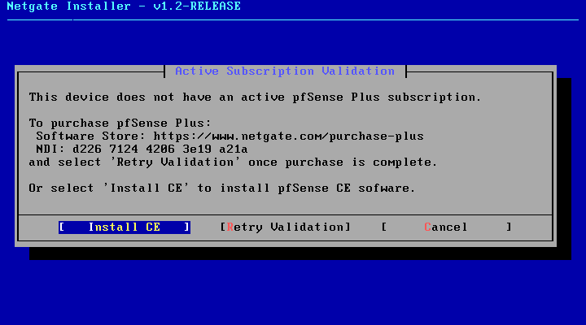
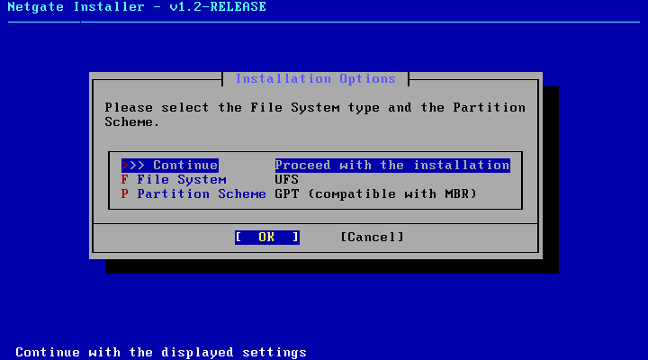
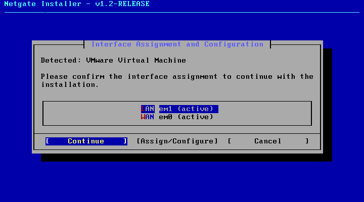
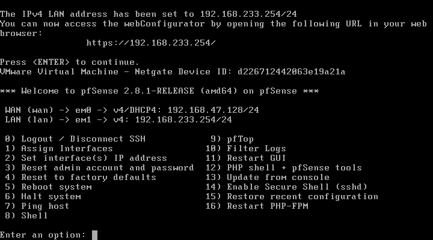

# 01 — pfSense VM Creation

## Objective
Create the pfSense-Firewall VM in VMware Workstation Pro with the 3 network
adapters needed to isolate the lab from the host.

## VM Configuration

| Parameter | Value |
|---|---|
| Name | pfSense-Firewall |
| Guest OS | FreeBSD 13 64-bit |
| vCPU | 1 core |
| RAM | 1024 MB |
| Disk | 20 GB (single file) |
| Path | D:\VM\MACHINES\PFSENSE\ |

## Network Adapters

| Adapter | VMnet | Role |
|---|---|---|
| Adapter 1 | VMnet8 (NAT) | WAN |
| Adapter 2 | VMnet1 (Host-Only) | LAN/MGMT |
| Adapter 3 | VMnet2 (Host-Only) | OPT1/Lab |

## Installation — Netgate Installer v1.2

Official installer downloaded from shop.netgate.com. Requires Internet
connection during installation (uses VMnet8/NAT).

### WAN Step
Interface em0 configured as DHCP client on VMnet8.

### LAN Step
Interface em1 configured as static. IP set to 192.168.233.1/24
(later corrected after host conflict — see Fix IP section).

### pfSense CE Selection
No active Plus subscription — selected Install CE (free).

### Installation Options
File system: UFS — partitioning: GPT.

### Interface Assignment
LAN = em1 (active), WAN = em0 (active). em2 not visible
because no traffic — configured as OPT1 afterwards.

## First Boot — pfSense Console

| Interface | NIC | IP |
|---|---|---|
| WAN | em0 | 192.168.47.128/24 (DHCP from VMnet8) |
| LAN | em1 | 192.168.233.254/24 (static, post-fix) |
| OPT1 | em2 | Not yet configured |

**Installed version:** pfSense 2.8.1-RELEASE amd64 (20251215-1731)

## Fix IP — Host/pfSense Conflict

**Problem:** VMware automatically assigns 192.168.233.1 to the host
VMnet1 adapter. pfSense LAN was configured on the same IP — direct conflict.

**Solution:** pfSense LAN changed to 192.168.233.254/24 from console
(option 2 — Set interface IP address).

| Device | IP | Network |
|---|---|---|
| Host Windows (VMnet1) | 192.168.233.1 | VMnet1 |
| pfSense LAN | 192.168.233.254 | VMnet1 |
| pfSense WAN | 192.168.47.128 | VMnet8 NAT |

**Lesson learned:** Always check for IP conflicts between VMware virtual
host adapters and VMs before configuring interfaces.

## Snapshots
- `00-pre-installazione` — VM created, not started
- `01-pfsense-installato-e-avviato` — pfSense operational, pre-webGUI
- `02-pfsense-lan-ip-corretto` — LAN corrected to .254, NordVPN disabled
