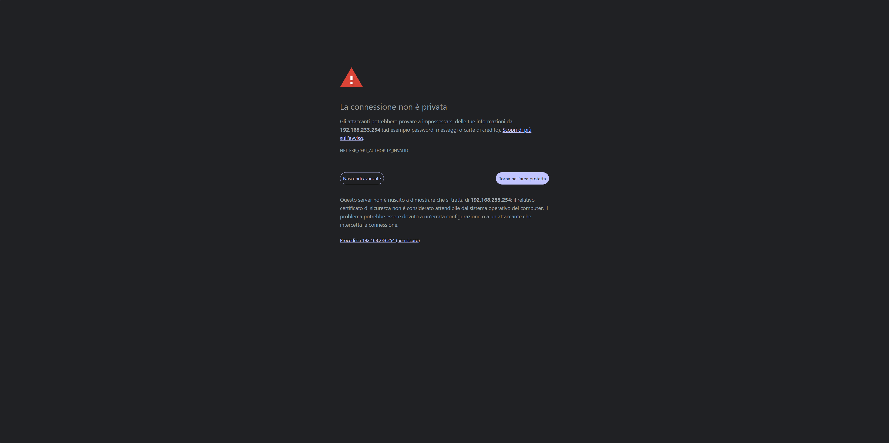
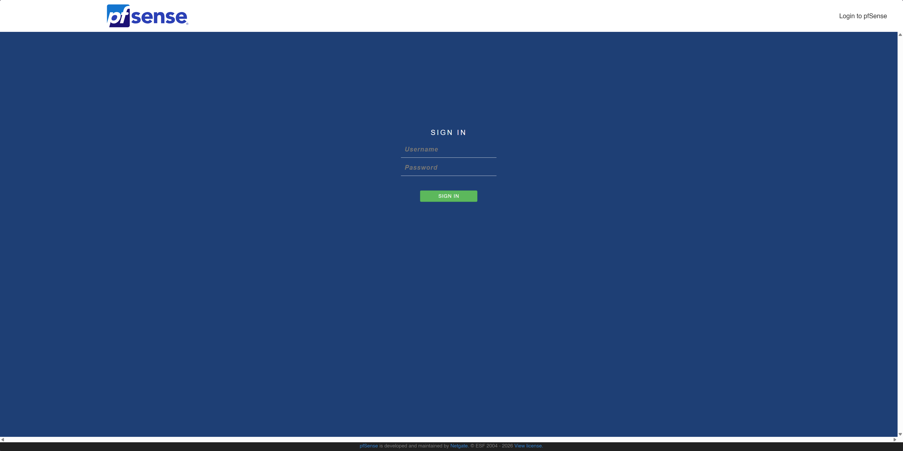
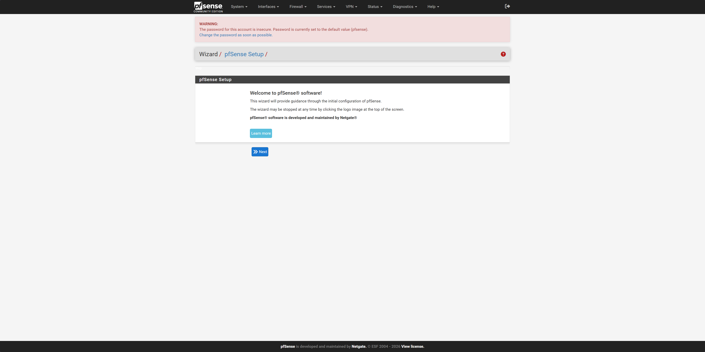
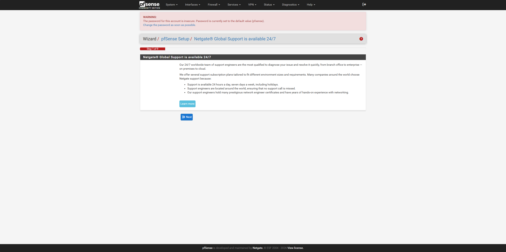
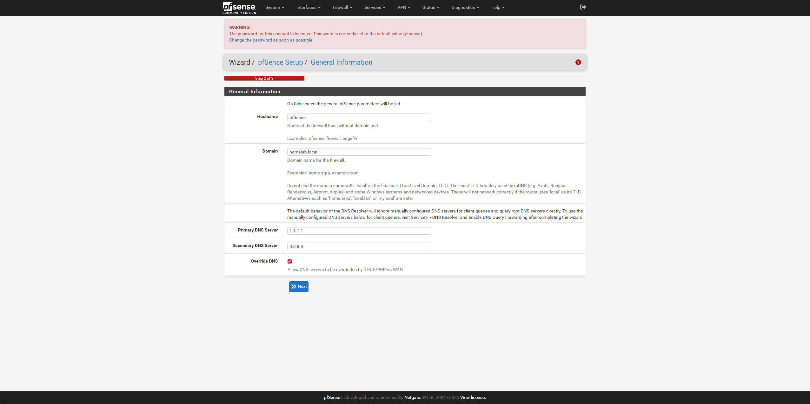
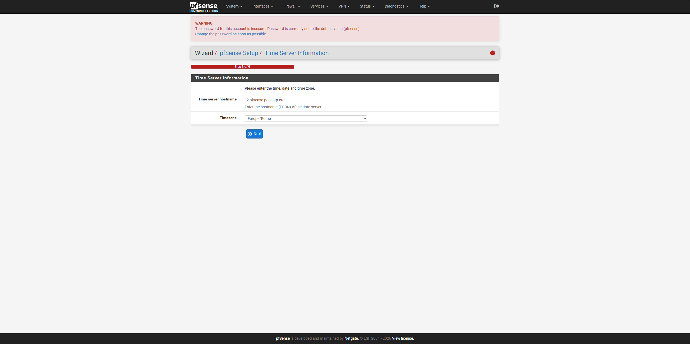
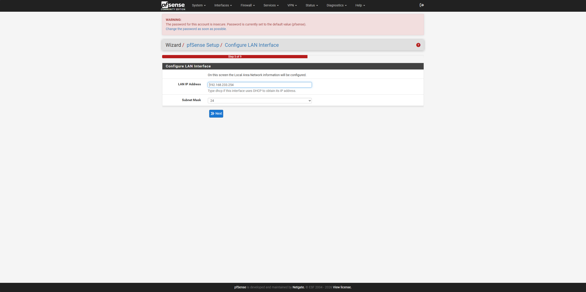
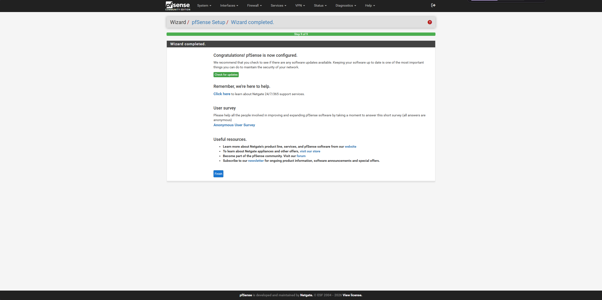
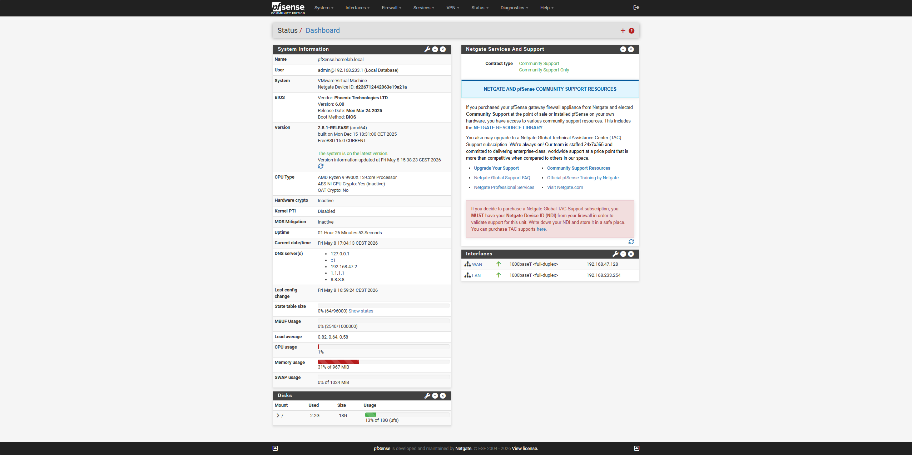

# 02 — Configurazione WebGUI pfSense

## Accesso WebGUI

- **URL:** https://192.168.233.254
- **Certificato:** self-signed (avviso browser normale in ambiente lab)
- **Credenziali:** admin / [password personalizzata]

## Setup Wizard (9 Step)

### Step 1 — Netgate Global Support
Pagina informativa, nessuna azione richiesta.

### Step 2 — General Information

| Parametro | Valore |
|---|---|
| Hostname | pfSense |
| Domain | homelab.local |
| Primary DNS | 1.1.1.1 |
| Secondary DNS | 8.8.8.8 |
| Override DNS | ✅ |

### Step 3 — Time Server

| Parametro | Valore |
|---|---|
| NTP Server | 2.pfsense.pool.ntp.org |
| Timezone | Europe/Rome |

### Step 5 — Configure LAN Interface
LAN confermata a 192.168.233.254/24.

### Step 9 — Wizard Completato

## Dashboard Post-Wizard

## Stato Sistema Post-Wizard

| Voce | Stato |
|---|---|
| Versione | pfSense 2.8.1-RELEASE ✅ |
| Aggiornamenti | Nessuno (latest) ✅ |
| Password admin | Modificata ✅ |
| WAN | 192.168.47.128/24 ✅ |
| LAN | 192.168.233.254/24 ✅ |

## Nota — Password Default
Il wizard non ha mostrato lo step di cambio password come atteso.
Il banner rosso ha segnalato la password default ancora attiva.
Modificata manualmente via System → User Manager.

**Lezione imparata:** Dopo ogni installazione verificare sempre
le credenziali default — non fidarsi che il wizard le abbia cambiate.

## Snapshot
- `03-pfsense-wizard-completato` — Wizard completato. Password Aggiornata