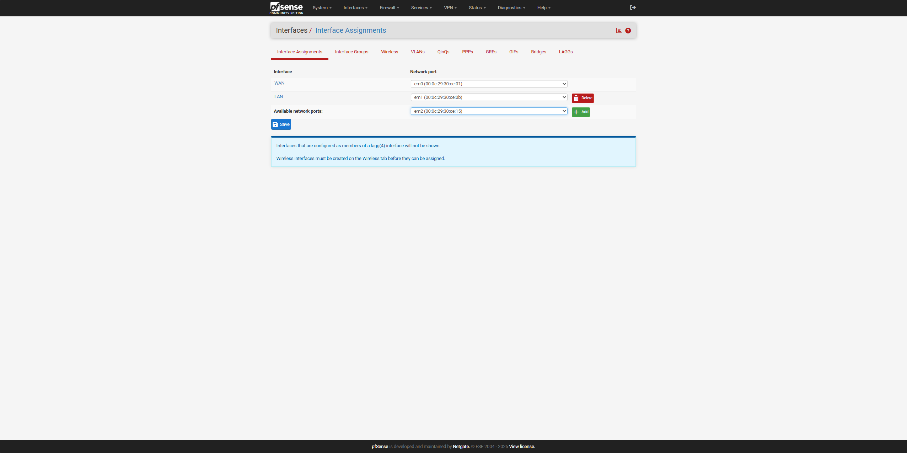
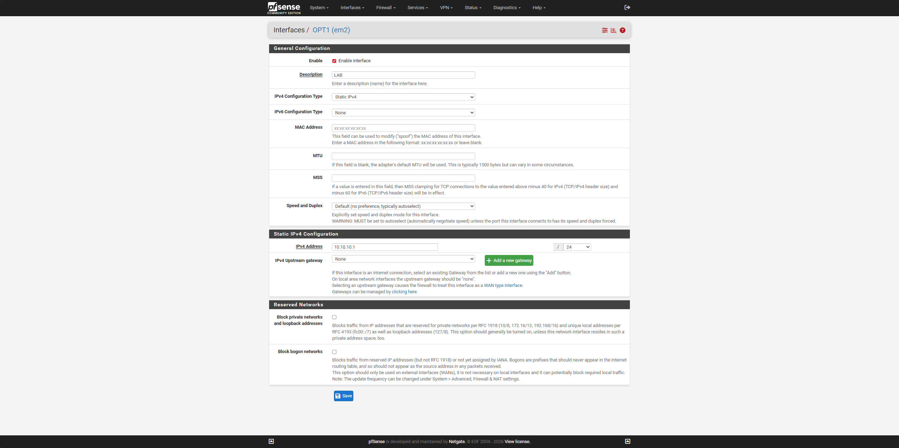
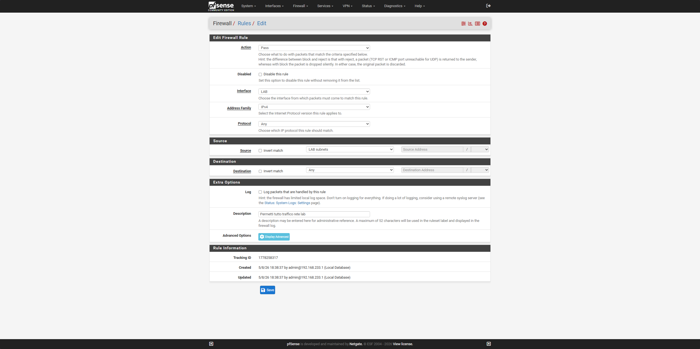
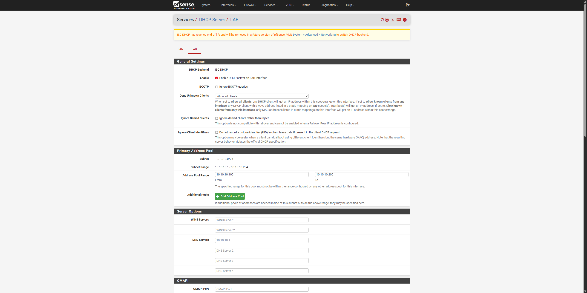
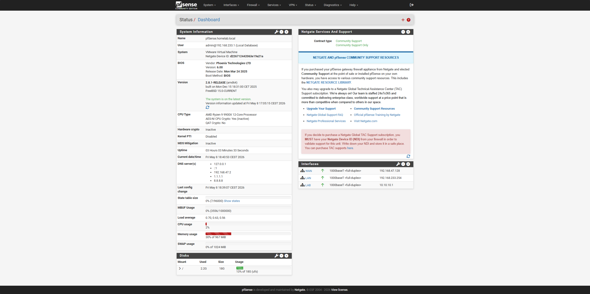

# 03 — LAB Interface Configuration (OPT1)

## Objective
Enable em2 as LAB interface on pfSense connected to VMnet2
(10.10.10.0/24). This network will host all attacker and target VMs.

## Step 1 — Interface Assignments
Added em2 from Interfaces > Assignments page.

## Step 2 — OPT1/LAB Configuration
Interface enabled, renamed LAB, static IP 10.10.10.254/24.

## Step 3 — LAB DHCP Server
DHCP enabled for range 10.10.10.100 - 10.10.10.200.

## Step 4 — Firewall Rule
Pass rule on LAB interface: source LAB subnets,
destination any, protocol any.

## Final Result — Dashboard
All 3 interfaces active and operational.

## Full Configuration

| Interface | Physical | IP | VMnet | Purpose |
|---|---|---|---|---|
| WAN | em0 | 192.168.47.128/24 (DHCP) | VMnet8 | Internet |
| LAN | em1 | 192.168.233.254/24 | VMnet1 | Management |
| LAB | em2 | 10.10.10.254/24 | VMnet2 | Lab VM network |

## LAB DHCP
- Range: 10.10.10.100 → 10.10.10.200
- Gateway: 10.10.10.254
- DNS: 10.10.10.254

## Snapshots
- `04-pfsense-opt1-lab-configurata` — LAB configured, em2 interface activated
- `05-pfsense-lab-gateway-254-internet-ok` — LAB interface corrected to .254, same fix as LAN

## Notes
Yellow banner in DHCP: ISC DHCP will be removed in future versions
of pfSense. Not a problem for the current lab — ignorable.
