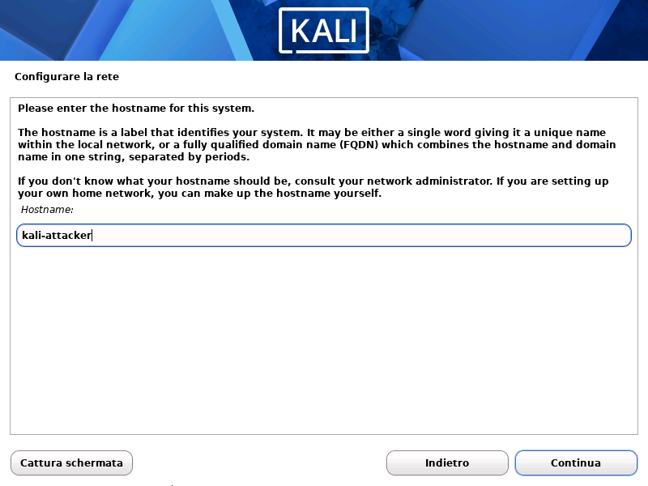
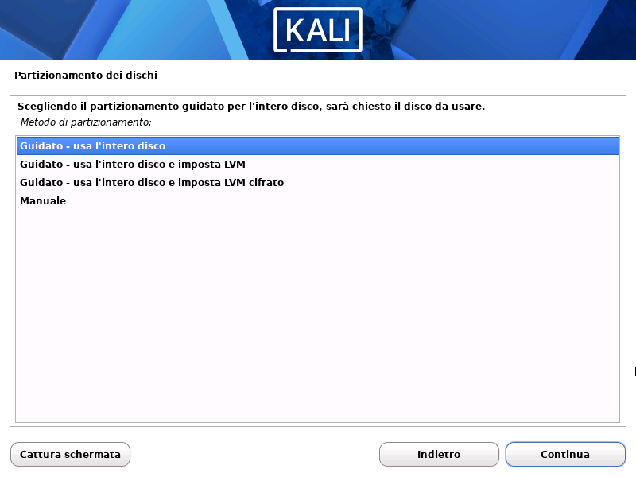
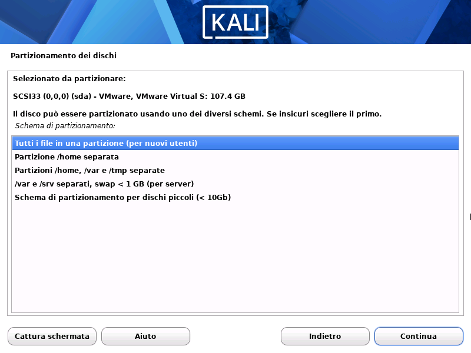
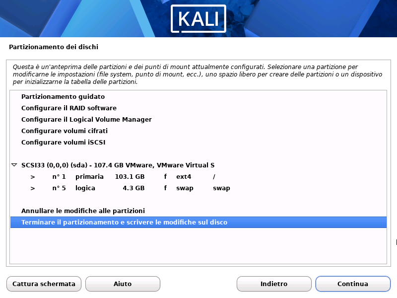
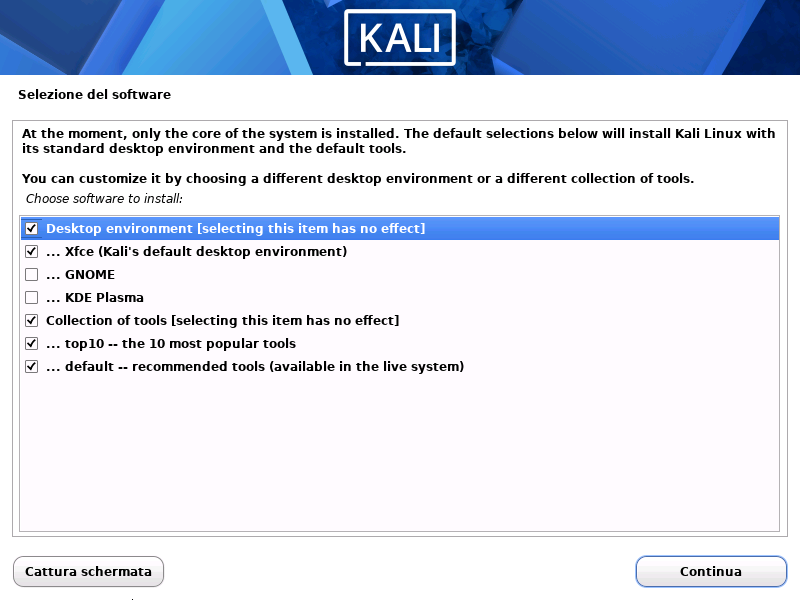
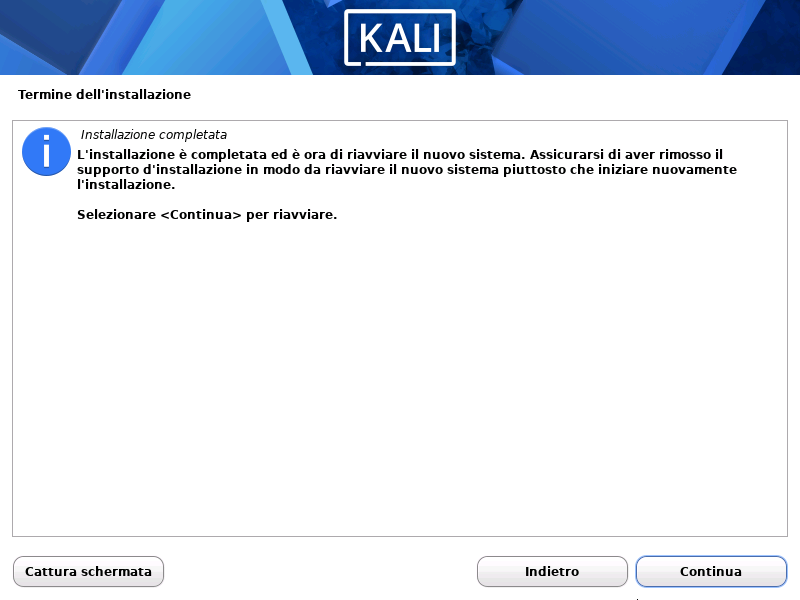
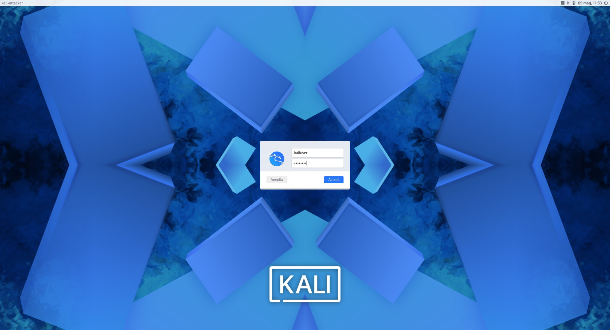
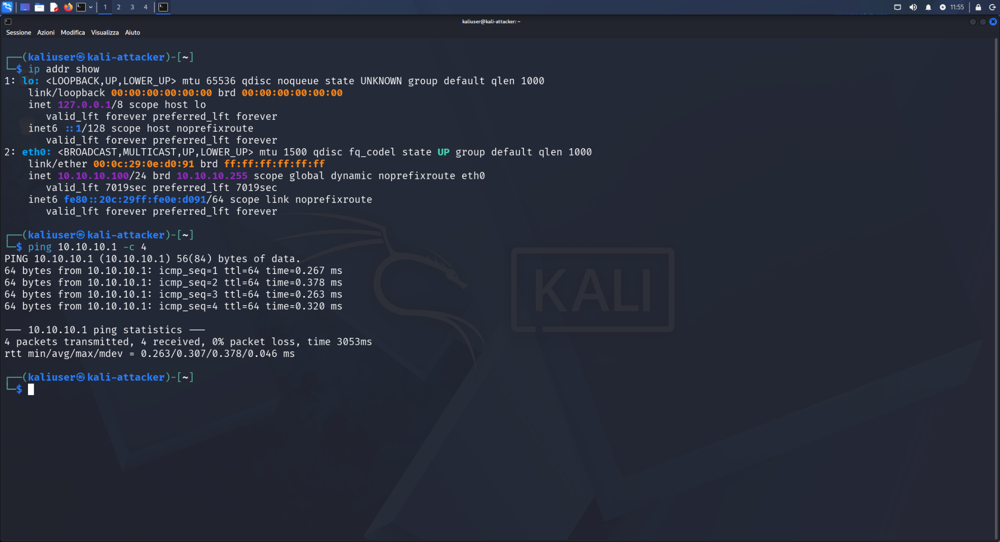
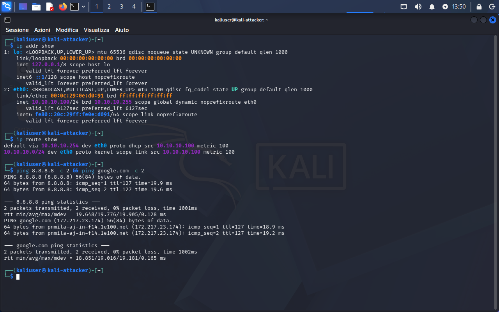

# 04 — Installazione Kali Linux (Attacker VM)

## Obiettivo
Installare Kali Linux come VM attacker sulla rete LAB (VMnet2/10.10.10.0/24).
Questa VM è il punto di partenza per tutte le attività Red Team del lab.

## Configurazione VM

| Parametro   | Valore                          |
| ----------- | ------------------------------- |
| Nome VMware | Kali-Attacker                   |
| OS          | Kali Linux 2026.1 (base Debian) |
| vCPU        | 2 core                          |
| RAM         | 4096 MB                         |
| Disco       | 100 GB (single file, SCSI)      |
| Rete        | VMnet2 (LAB — 10.10.10.0/24)    |
| Percorso    | D:\VM\MACHINES\KALI-ATTACKER\   |

## Installazione — Parametri Scelti

### Rete
Hostname e dominio configurati durante il wizard.




### Utente
Kali moderno non usa root come utente principale.
Creato utente standard con sudo.


### Partizionamento
Schema semplice — tutto in una partizione, adatto a VM lab.





Risultato: 103.1 GB ext4 (/) + 4.3 GB swap.




### Software Installato

| Componente | Stato |
|---|---|
| Desktop XFCE | ✅ |
| Top 10 tools | ✅ |
| Default tools | ✅ |



### GRUB e Fine Installazione




## Primo Avvio



## Verifica Rete — Risultati

```bash
ip addr show
# eth0: 10.10.10.100/24 — IP assegnato da DHCP pfSense ✅

ip route show
# default via 10.10.10.254 dev eth0 proto dhcp src 10.10.10.100 metric 100

ping 10.10.10.254 -c 4
# 4 pacchetti inviati, 4 ricevuti, 0% packet loss ✅
```



## Verifica Internet — Post Fix DNS

```bash
ping 8.8.8.8 -c 2
# 2/2 pacchetti ricevuti ✅ (connettività IP)

ping google.com -c 2
# 2/2 pacchetti ricevuti ✅ (risoluzione DNS funzionante)
```



## Mappa Rete Post-Installazione

| VM | IP | Rete | Ruolo |
|---|---|---|---|
| pfSense (LAN) | 192.168.233.254 | VMnet1 | Firewall/Gateway mgmt |
| pfSense (LAB) | 10.10.10.254 | VMnet2 | Gateway rete lab |
| Kali Linux | 10.10.10.100 | VMnet2 | Attacker |
| Metasploitable2 | (da configurare) | VMnet2 | Target |

## Snapshot
- `00-kali-pre-installazione` — VM creata, ISO montata
- `01-kali-installato-desktop-ok` — Kali operativo, IP confermato
- `02-kali-prima-exploitation-bindshell`
- `03-kali-vsftpd-exploit-metasploit`
- `04-kali-internet-ok-post-dns-fix`

## Lezioni Imparate
- Il disco da 100GB viene mostrato come 107.4GB da VMware
  (differenza tra GB decimali e binari — normale)
- Kali assegna automaticamente IP .100 come primo lease DHCP
- Il ping al gateway pfSense (10.10.10.254) è il test minimo per
  confermare che la rete lab funziona correttamente
- Verificare sempre anche il ping a 8.8.8.8 (connettività) e a
  google.com (DNS) — la rete può funzionare senza internet se
  pfSense non ha la regola NAT corretta