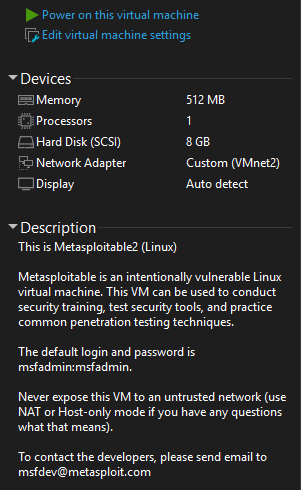
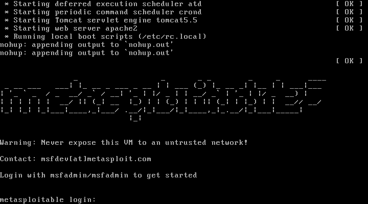
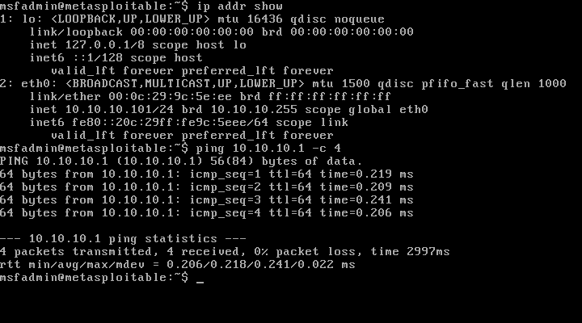
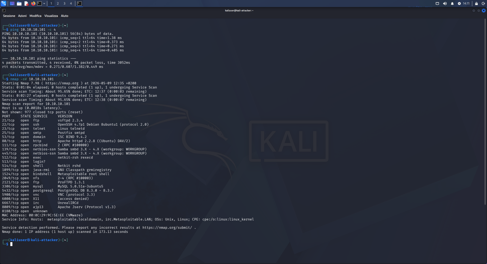

# 05 — Metasploitable2 Import (Target VM)

## Objective
Import Metasploitable2 as the first target VM in the lab.
Intentionally vulnerable Linux VM for penetration testing practice.

## What is Metasploitable2
- Based on Ubuntu 8.04
- Dozens of pre-configured vulnerable services
- Specifically designed to be compromised in a lab
- Default public credentials: msfadmin/msfadmin

## ⚠️ Absolute Security Rule
**Never connect this VM to NAT or Bridged.**
VMnet2 (isolated LAB) only. The VM itself warns at boot:
"Never expose this VM to an untrusted network!"

## VM Configuration

| Parameter | Value |
|---|---|
| Import | File → Open → Metasploitable2.vmx |
| RAM | 512 MB |
| CPU | 1 core |
| Disk | 8 GB |
| Network | VMnet2 (LAB) ✅ |



## Boot

VM has no GUI — text terminal only.
At boot it shows the security warning and credentials.



## Network Verification from Metasploitable

```bash
ip addr show
# eth0: 10.10.10.101/24 — IP from pfSense DHCP ✅

ping 10.10.10.254 -c 4
# 4/4 packets received, 0% loss ✅
```



## First Recon from Kali — nmap -sV

First real offensive command: service version scan on target.

```bash
ping 10.10.10.101 -c 4   # check reachability
nmap -sV 10.10.10.101    # service and version enumeration
```



## nmap Results — Detected Services

| Port | Service | Version | Notes |
|---|---|---|---|
| 21 | FTP | vsftpd 2.3.4 | Known backdoor |
| 22 | SSH | OpenSSH 4.7p1 | Outdated version |
| 23 | Telnet | Linux telnetd | Cleartext traffic |
| 80 | HTTP | Apache 2.2.8 | Vulnerable web server |
| 139/445 | SMB | Samba 3.X-4.X | Network shares |
| 1524 | Bindshell | **Root shell open** | Direct root access |
| 3306 | MySQL | 5.0.51a | Exposed database |
| 5432 | PostgreSQL | 8.3.0-8.3.7 | Exposed database |
| 5900 | VNC | Protocol 3.3 | Remote desktop |
| 6667 | IRC | UnrealIRCd | Backdoored version |

**977 closed ports** — only these open and vulnerable.

## Full Network Map — End of Phase 1

| VM | IP | VMnet | Role |
|---|---|---|---|
| Host Windows | 192.168.233.1 | VMnet1 | Physical host |
| pfSense LAN | 192.168.233.254 | VMnet1 | Firewall mgmt |
| pfSense LAB | 10.10.10.254 | VMnet2 | Lab gateway |
| Kali Linux | 10.10.10.100 | VMnet2 | Attacker |
| Metasploitable2 | 10.10.10.101 | VMnet2 | Target |

## Snapshots
- `00-metasploitable2-pre-avvio`
- `01-metasploitable2-avviato-rete-ok`
- `02-meta-rete-ok-pre-exploit-unrealircd`
- `03-meta-post-unrealircd`

## Lessons Learned
- Pre-configured VMs (.vmx) import without installation
- ALWAYS check network adapter before starting vulnerable VMs
- nmap -sV identifies both services AND versions — essential for
  finding CVEs (known vulnerabilities) associated with each version
- Open port 1524 on Metasploitable is an extreme example:
  a root shell exposed on the network is the worst possible vulnerability
