# 06 — Ubuntu Server LTS Installation (Blue Team VM)

## Objective
Install Ubuntu Server LTS as the Blue Team VM on the LAB network
(VMnet2/10.10.10.0/24). This VM will host Wazuh SIEM to monitor
and detect attack activities in the lab.

## VM Configuration

| Parameter   | Value                                              |
| ----------- | -------------------------------------------------- |
| VMware name | Ubuntu-BlueTeam                                    |
| OS          | Ubuntu Server 26.04 LTS (GNU/Linux 7.0.0 x86_64)  |
| vCPU        | 2 cores                                            |
| RAM         | 6144 MB (increased from 4096 MB for Wazuh requirements) |
| Disk        | 100 GB (single file, SCSI)                         |
| Network     | VMnet2 (LAB — 10.10.10.0/24)                      |
| Path        | D:\VM\MACHINES\UBUNTU-BLUETEAM\                    |

## Installation — Chosen Parameters

### Language and Keyboard
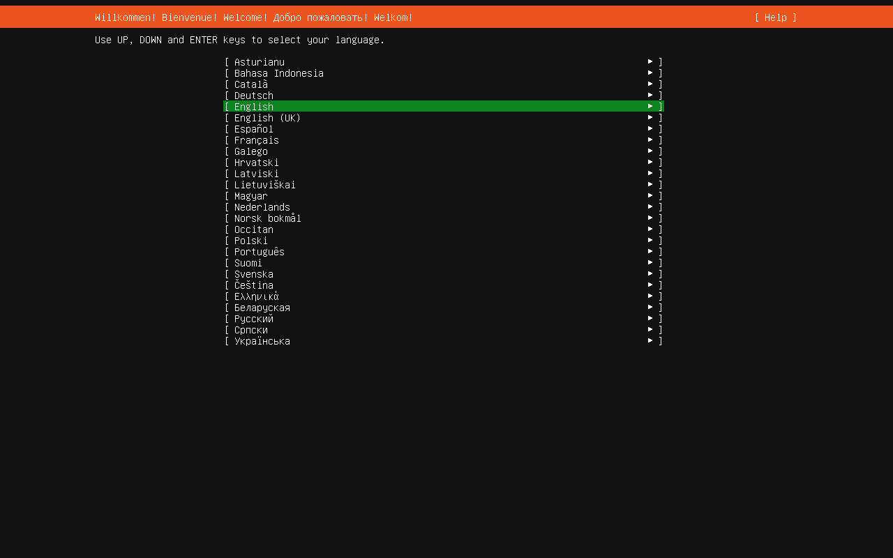
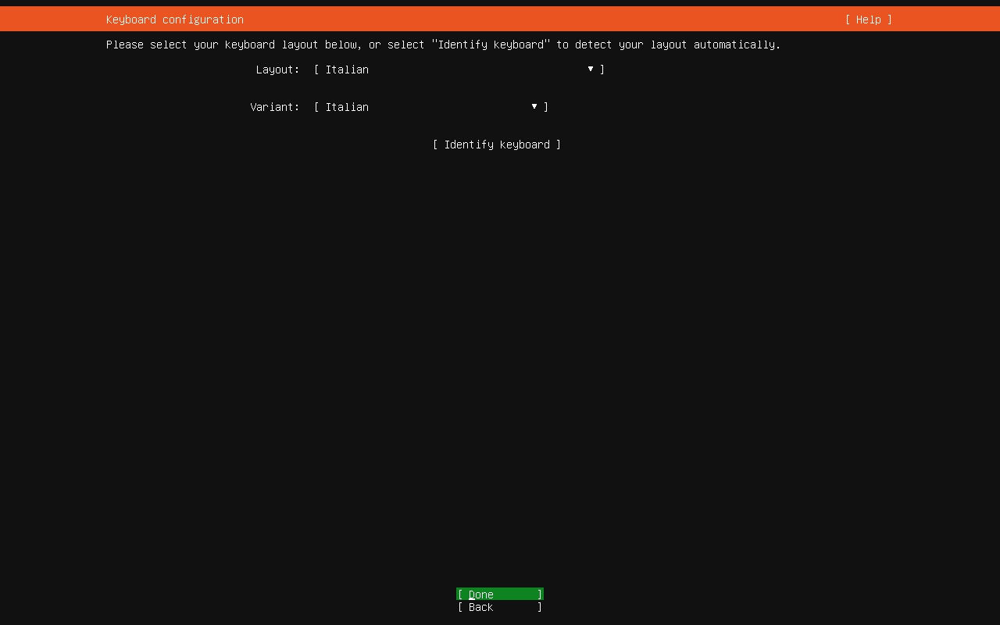

### Network
pfSense DHCP assigned 10.10.10.103/24 during installation.
On first reboot IP changed to 10.10.10.105/24 — normal
with DHCP, but problematic for a server. Fixed with static IP
after installation (see Static IP Fix section).

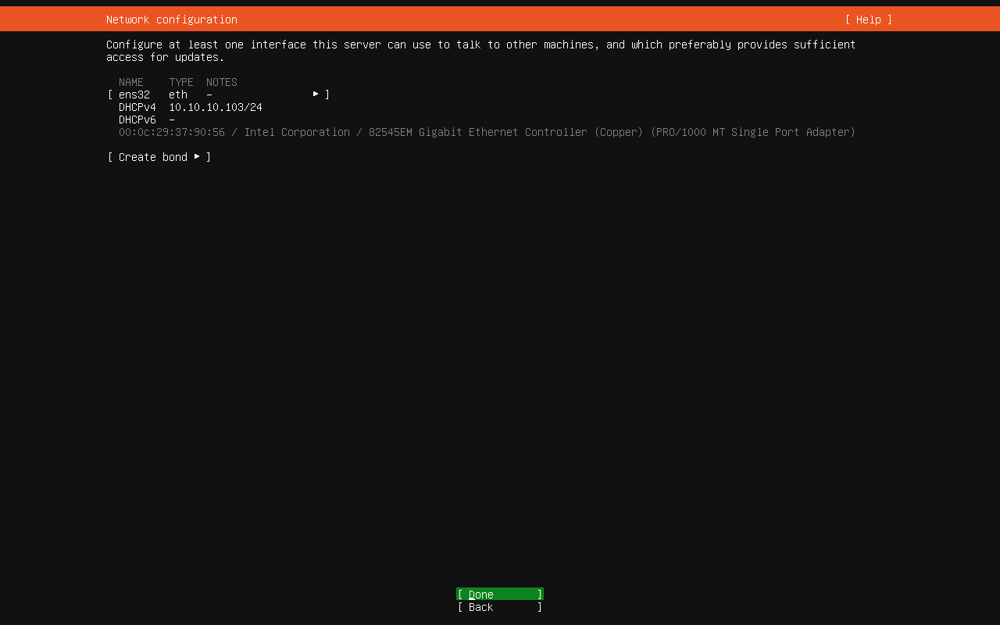

### Partitioning
Simple scheme — everything in one ext4 partition on 100 GB disk.

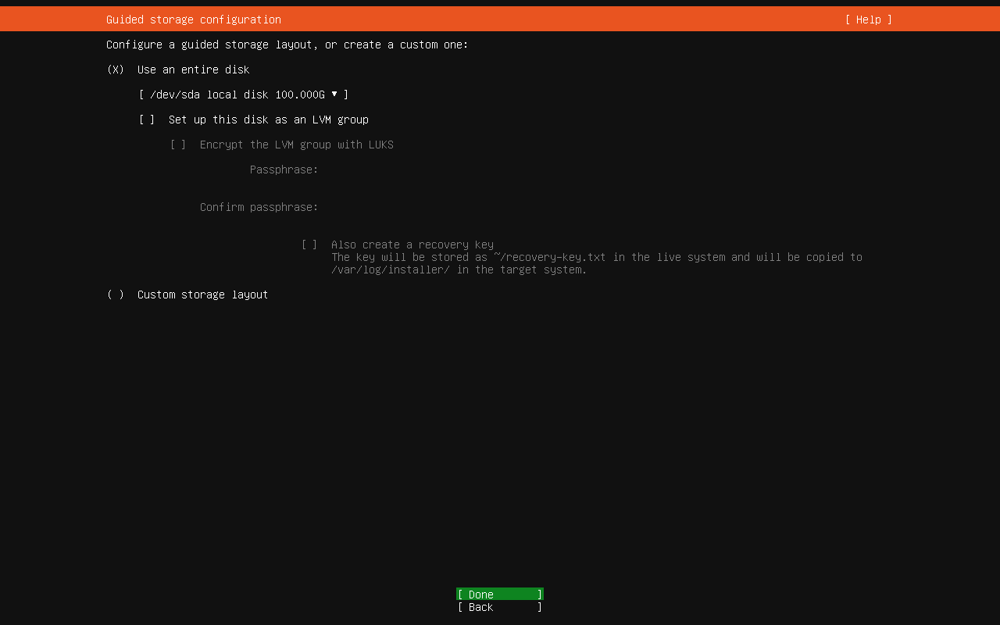
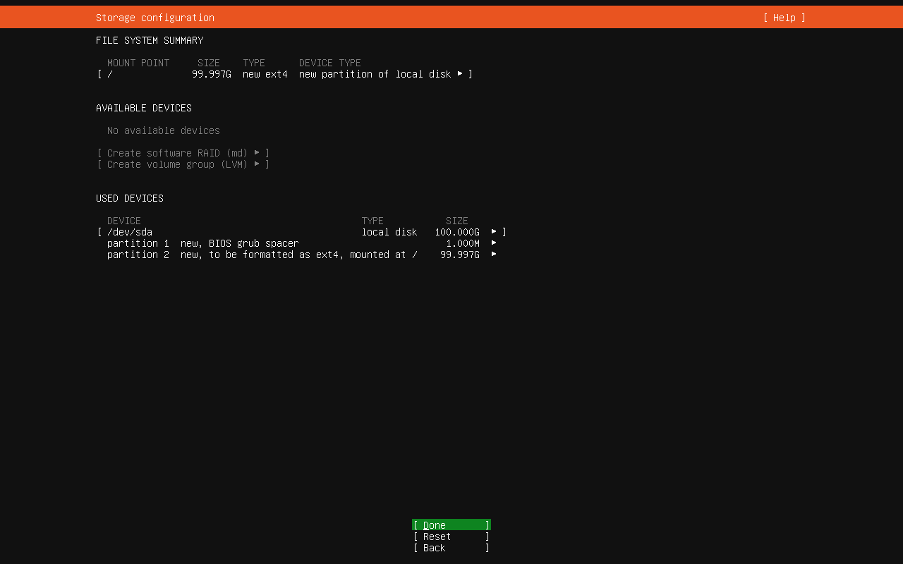

### User and SSH

| Field | Value |
|---|---|
| Name | Blue Team |
| Hostname | ubuntu-blueteam |
| Username | blueteam |
| OpenSSH | ✅ installed |

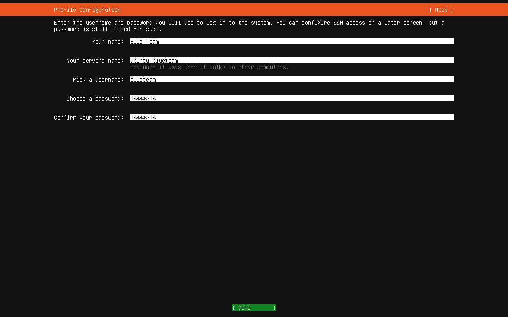
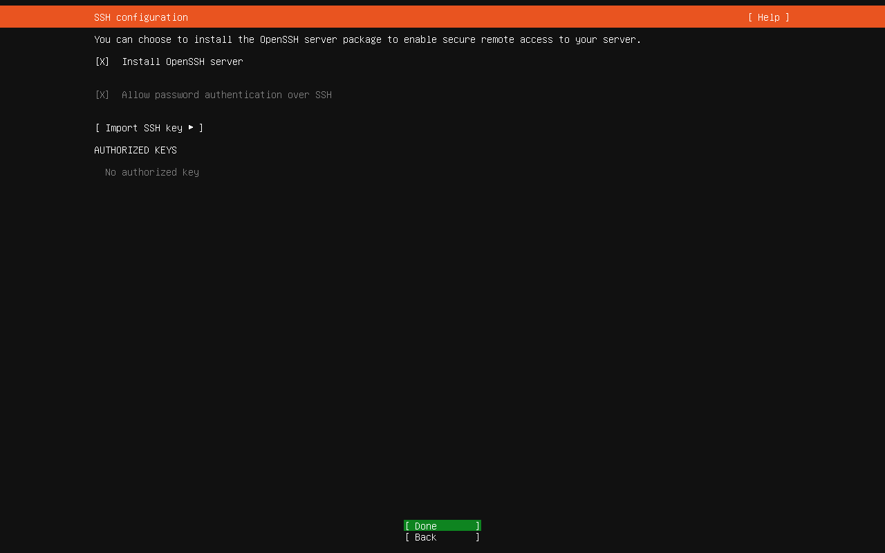

### Additional Snaps
None selected — Wazuh will be installed manually.

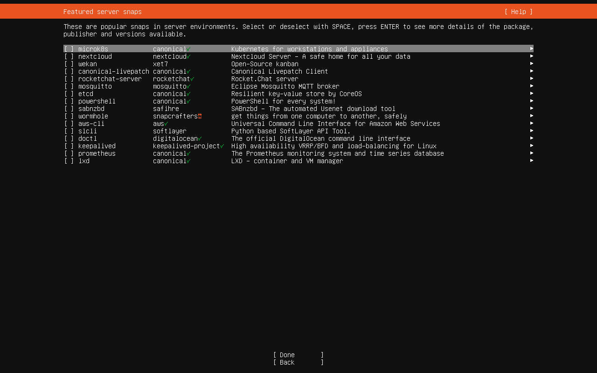
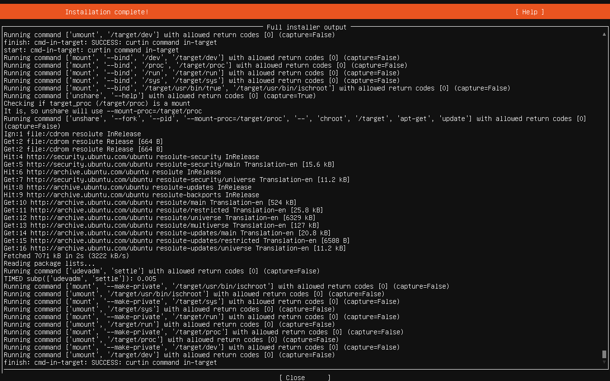

## First Boot

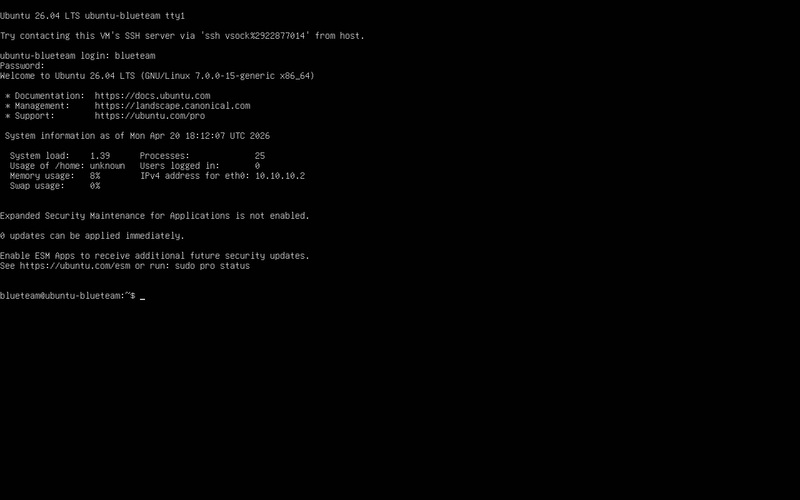

## Fix — Static IP

With DHCP the IP can change at every reboot, making SSH and Wazuh
unstable. Ubuntu 26.04 uses **Netplan** for network configuration.

> **Note:** Ubuntu 26.04 saves the Netplan config as
> `00-installer-config.yaml`, not `50-cloud-init.yaml`.
> Verify the actual filename with `ls /etc/netplan/` before editing.

```bash
ls /etc/netplan/
# → 00-installer-config.yaml

sudo nano /etc/netplan/00-installer-config.yaml
```

Replace content with:

```yaml
network:
  version: 2
  ethernets:
    ens32:
      dhcp4: false
      addresses:
        - 10.10.10.105/24
      routes:
        - to: default
          via: 10.10.10.254
      nameservers:
        addresses:
          - 10.10.10.254
          - 1.1.1.1
```

Apply:

```bash
sudo netplan apply
ip addr show ens32
# confirm: 10.10.10.105/24 static
```

## Network Verification

```bash
ip route show
# default via 10.10.10.254 dev ens32 proto static ✅

ip addr show
# ens32: 10.10.10.105/24 ✅

ping 10.10.10.254 -c 4   # pfSense gateway ✅
ping 10.10.10.100 -c 4   # Kali ✅
ping 10.10.10.101 -c 4   # Metasploitable2 ✅
```

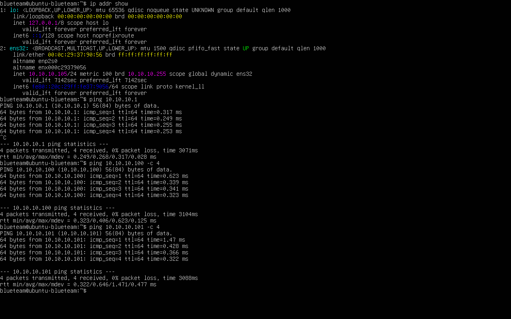

## Internet Verification — Post DNS Fix

```bash
ping 8.8.8.8 -c 2
# 2/2 packets received ✅ (IP connectivity)

ping google.com -c 2
# 2/2 packets received ✅ (DNS resolution working)
```

Output of `ip route show` shows `proto static` — confirms
Netplan static IP is active and not DHCP.

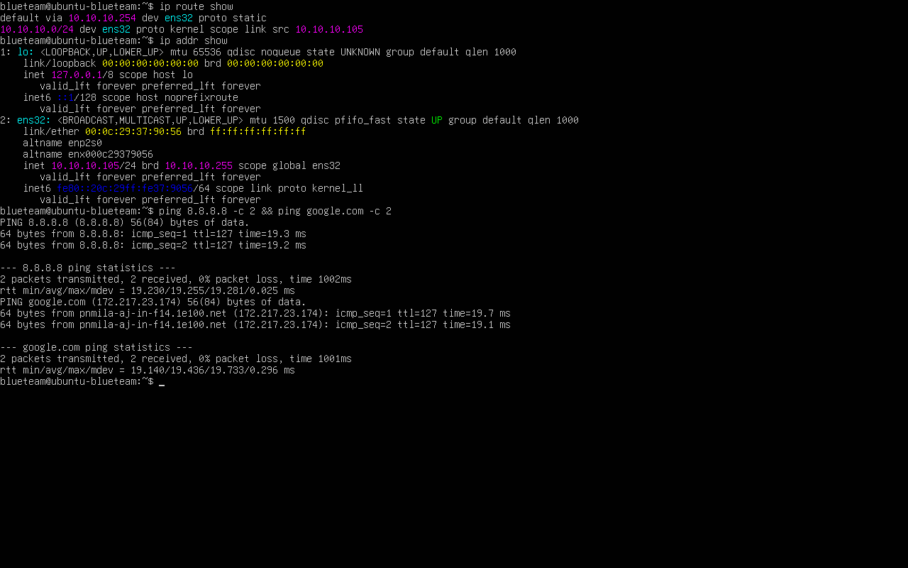

## SSH Access from Kali

```bash
ping 10.10.10.105 -c 2
ssh blueteam@10.10.10.105
# accept fingerprint: yes
whoami   # blueteam
```

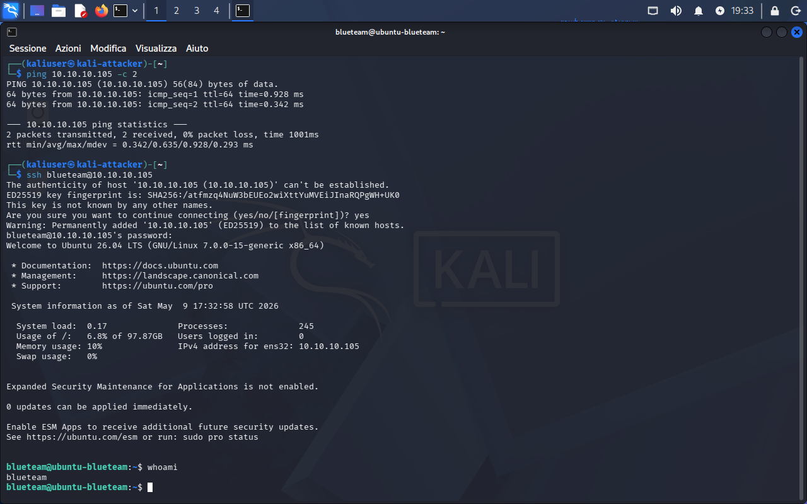

## Full Network Map

| VM | IP | VMnet | Role |
|---|---|---|---|
| Host Windows | 192.168.233.1 | VMnet1 | Physical host |
| pfSense LAN | 192.168.233.254 | VMnet1 | Firewall mgmt |
| pfSense LAB | 10.10.10.254 | VMnet2 | Lab gateway |
| Kali Linux | 10.10.10.100 | VMnet2 | Attacker |
| Metasploitable2 | 10.10.10.101 | VMnet2 | Target |
| Ubuntu Server | 10.10.10.105 | VMnet2 | Blue Team / SIEM |

## Snapshots
- `00-ubuntu-pre-installazione` — VM created, ISO mounted
- `01-ubuntu-installato-rete-ok` — Ubuntu operational, SSH working
- `02-ubuntu-internet-ok-pre-wazuh` — Static IP 10.10.10.105, ready for Wazuh
- `03-ubuntu-wazuh-installato-dashboard-ok` — Wazuh installed, dashboard accessible
- `04-ubuntu-wazuh-post-troubleshooting-ok` — All Wazuh issues resolved
- `05-ubuntu-filebeat-attivo-alert-ok` — Filebeat active, alerts visible in dashboard

## Lessons Learned
- Ubuntu Server 26.04 uses `ens32` instead of `eth0` — different
  name from Kali and Metasploitable2 (depends on VMware driver)
- DHCP on a server is an anti-pattern: IP can change at reboot
  breaking SSH, Wazuh agents, and any service that references it
- Netplan is the modern Ubuntu network configuration system —
  replaces `/etc/network/interfaces` from previous versions
- Ubuntu 26.04 saves Netplan config as `00-installer-config.yaml`,
  not `50-cloud-init.yaml` — always verify with `ls /etc/netplan/`
- SSH fingerprint on first connection is normal: accept it
  once and it gets stored in `~/.ssh/known_hosts`
- `proto static` in `ip route show` output confirms
  Netplan configuration is active and not DHCP
