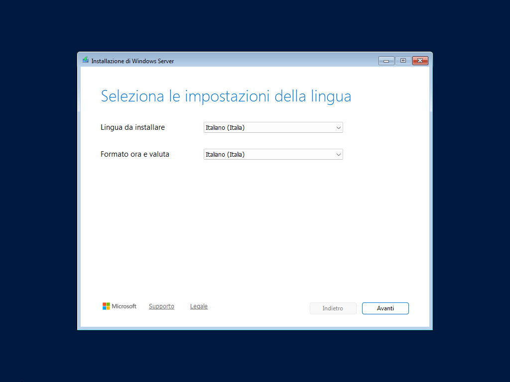
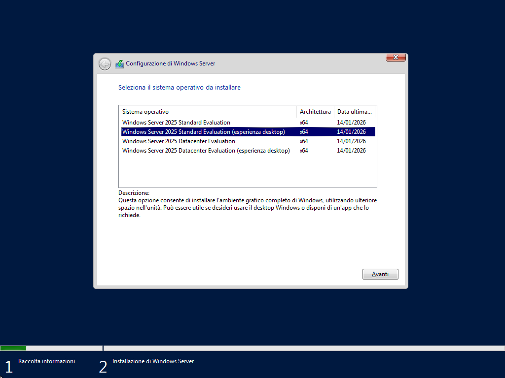
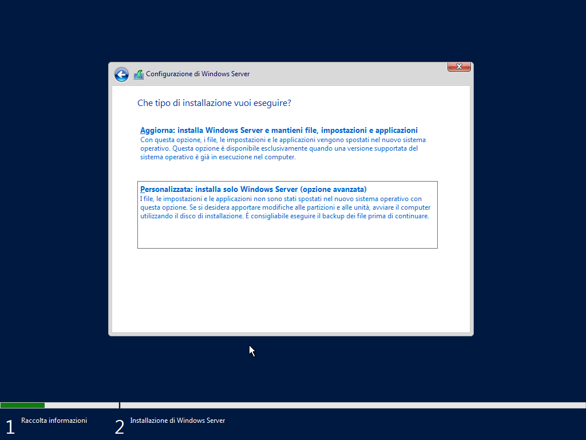
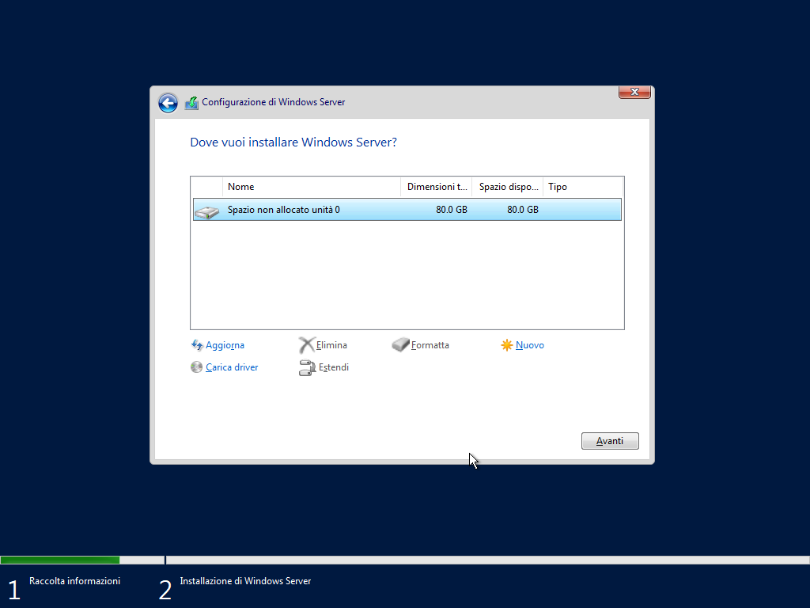
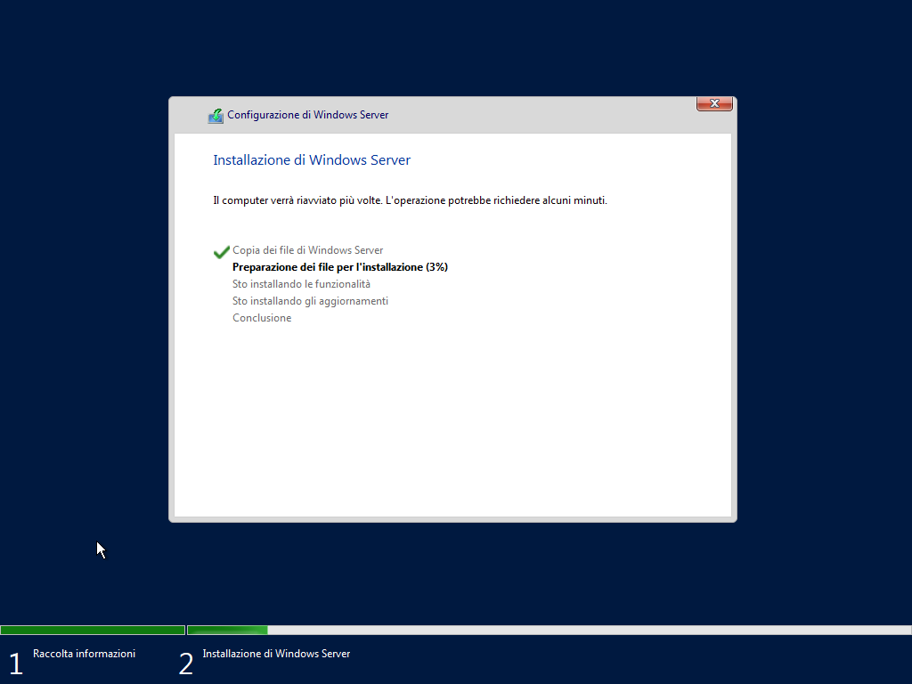
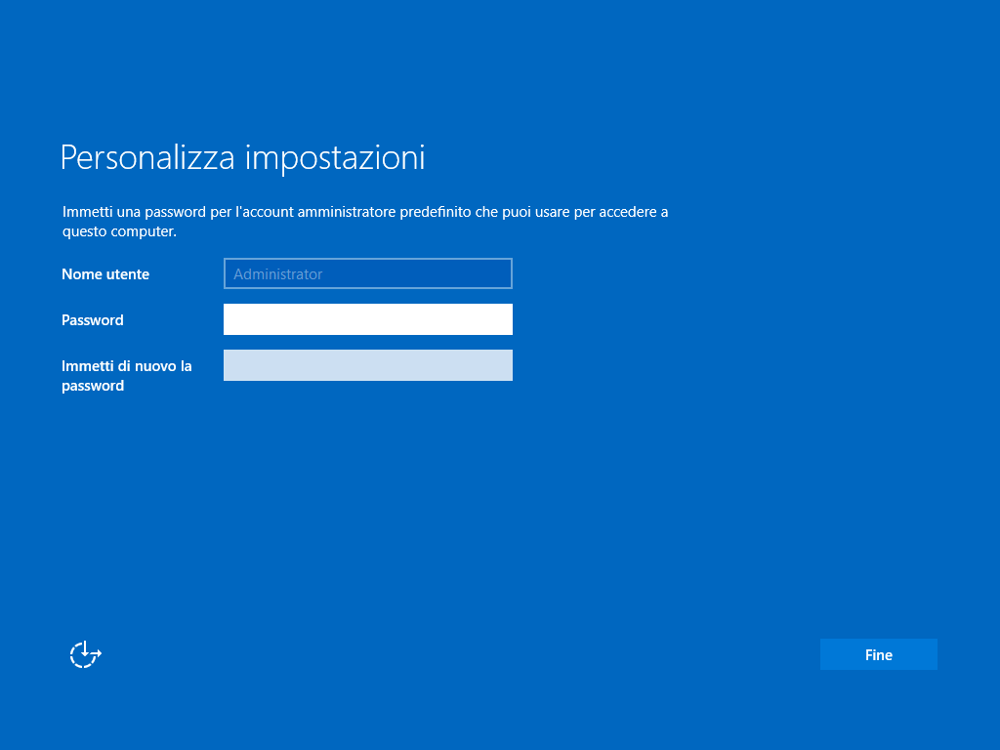
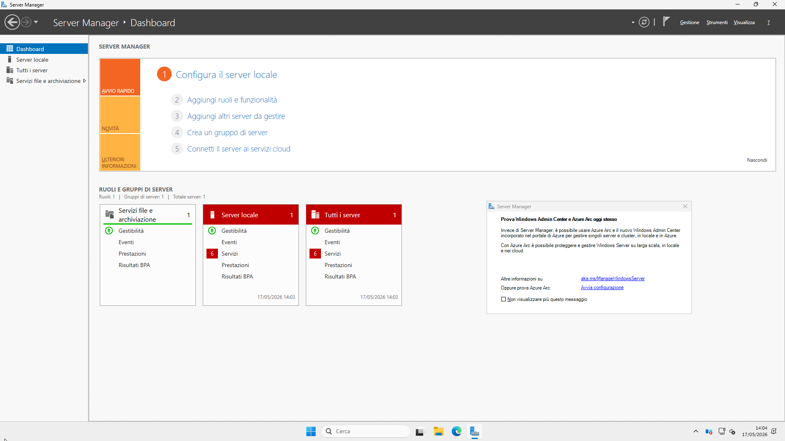
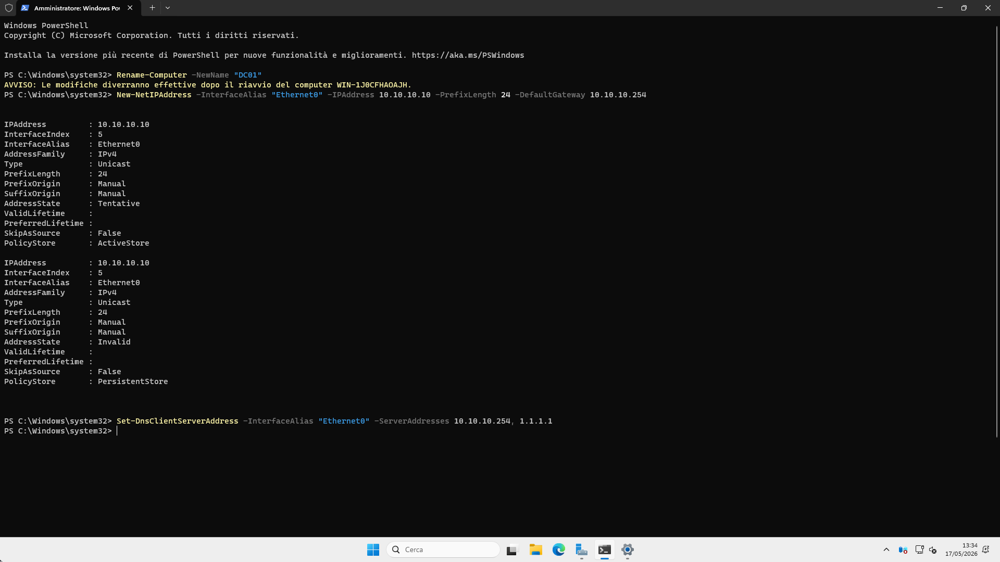
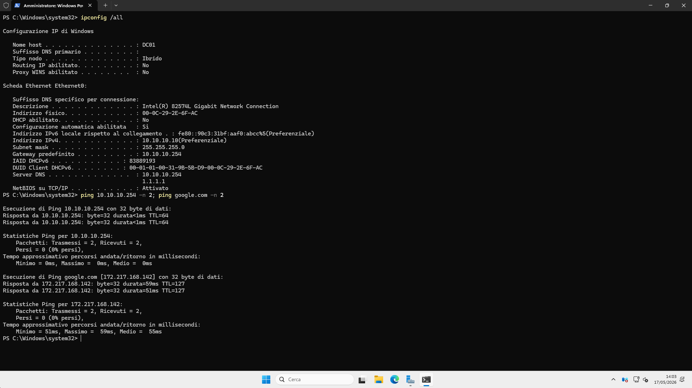

# 07 — Windows Server 2025 Installation (Domain Controller VM)

## Objective
Install Windows Server 2025 Standard Evaluation as the Domain Controller
for the Active Directory lab. This VM will host AD DS, DNS, and Kerberos
services for the `homelab.local` domain.

## VM Configuration

| Parameter | Value |
|---|---|
| VMware name | WinServer2025-DC |
| OS | Windows Server 2025 Standard Evaluation (Desktop Experience) |
| vCPU | 2 cores |
| RAM | 4096 MB |
| Disk | 80 GB (single file, SCSI) |
| Network | VMnet2 (LAB — 10.10.10.0/24) |
| Path | D:\VM\MACHINES\WINSERVER2025-DC\ |
| TPM | Not required — Server 2025 Eval does not enforce TPM |

## Installation — Chosen Parameters

### Language
Italian language, Italian format for time and currency.



### OS Edition
Selected: **Windows Server 2025 Standard Evaluation (Desktop Experience)**

The Desktop Experience version installs the full GUI (Server Manager,
Explorer, etc.) — essential for lab work. The alternative "Core" version
is command-line only, suitable for production but harder to learn on.



### Installation Type
**Custom: Install Windows Server only (advanced)**

Clean installation on empty disk — no previous OS to preserve.



### Disk
80 GB unallocated — selected as-is, Windows formats automatically.



### Installation Progress
Files copied and prepared. Multiple automatic reboots during installation.



### Administrator Password
Set during first boot configuration:

| Account | Password |
|---|---|
| Administrator | Adm1n!str4tor |

> Lab environment — password meets complexity requirements
> (uppercase, lowercase, number, special character).



## First Boot — Server Manager

Server Manager opens automatically. Azure Arc promotion popup appears —
dismissed and disabled ("Do not show this message again").



## Post-Installation Configuration

All configuration done via **PowerShell (Run as Administrator)**.

### Step 1 — Rename computer to DC01

```powershell
Rename-Computer -NewName "DC01" -Restart
```

VM reboots and applies the new hostname.

### Step 2 — Set static IP and DNS

```powershell
# Set static IP 10.10.10.10
New-NetIPAddress -InterfaceAlias "Ethernet0" `
  -IPAddress 10.10.10.10 `
  -PrefixLength 24 `
  -DefaultGateway 10.10.10.254

# Set DNS: pfSense as primary (for internet), 1.1.1.1 as secondary
# Note: after AD DS installation, primary DNS will change to 127.0.0.1
Set-DnsClientServerAddress -InterfaceAlias "Ethernet0" `
  -ServerAddresses 10.10.10.254, 1.1.1.1
```



## Network Verification

```powershell
ipconfig /all
ping 10.10.10.254 -n 2    # pfSense gateway
ping google.com -n 2       # Internet + DNS resolution
```

Results:
```
Host name:      DC01
IPv4 Address:   10.10.10.10
Subnet mask:    255.255.255.0
Default gateway: 10.10.10.254
DNS servers:    10.10.10.254
                1.1.1.1
DHCP enabled:   No

Ping 10.10.10.254 → 2/2 received, <1ms ✅
Ping google.com   → 2/2 received, ~55ms ✅
```



## Full Network Map — Post DC01 Installation

| VM | IP | VMnet | Role |
|---|---|---|---|
| Host Windows | 192.168.233.1 | VMnet1 | Physical host |
| pfSense LAN | 192.168.233.254 | VMnet1 | Firewall mgmt |
| pfSense LAB | 10.10.10.254 | VMnet2 | Lab gateway |
| Kali Linux | 10.10.10.100 | VMnet2 | Attacker |
| Metasploitable2 | 10.10.10.101 | VMnet2 | Target |
| Ubuntu Server | 10.10.10.105 | VMnet2 | Blue Team / SIEM |
| **Windows Server 2025** | **10.10.10.10** | **VMnet2** | **Domain Controller** |

## Snapshot
- `00-winserver2025-installato-pre-ad` — Base OS installed, renamed DC01,
  static IP configured, internet verified. Ready for AD DS installation.

## Lessons Learned
- Windows Server 2025 Eval does not enforce TPM — installs without
  any hardware modification or VM encryption required
- The Desktop Experience edition is required for a graphical lab
  environment — Core edition is CLI-only
- Static IP must be set before installing AD DS — the DC's own IP
  must be stable since it will become the DNS server for the domain
- DNS servers: pfSense (10.10.10.254) set as primary for now to
  maintain internet access. After AD DS installation, this will
  change to 127.0.0.1 (DC listens on itself for DNS)
- The computer rename requires a reboot before taking effect —
  always reboot before verifying the hostname
