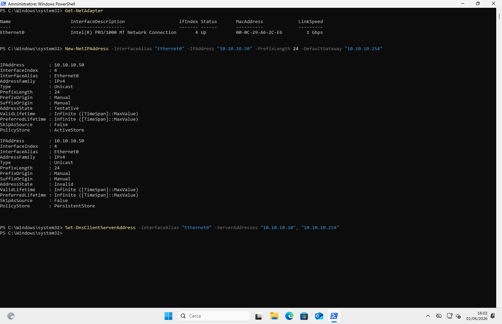
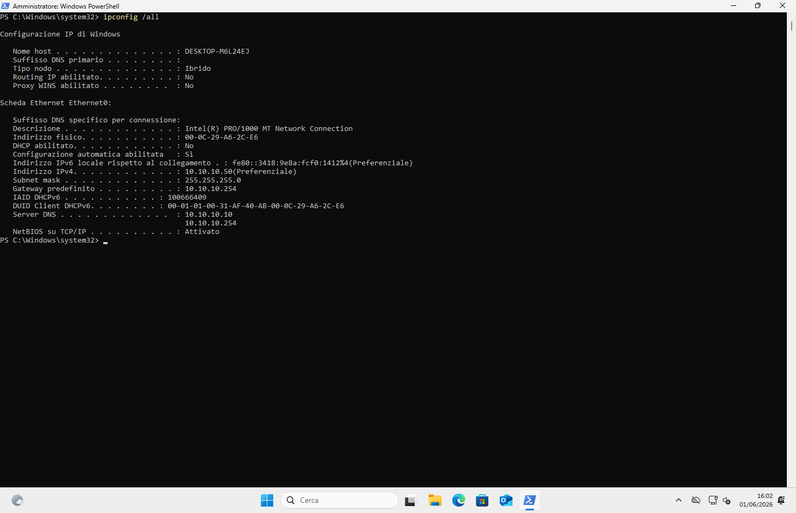
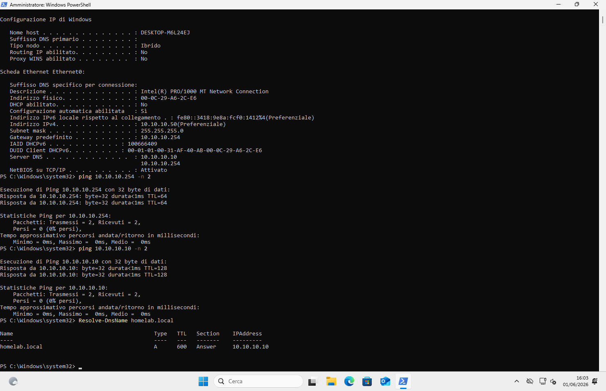
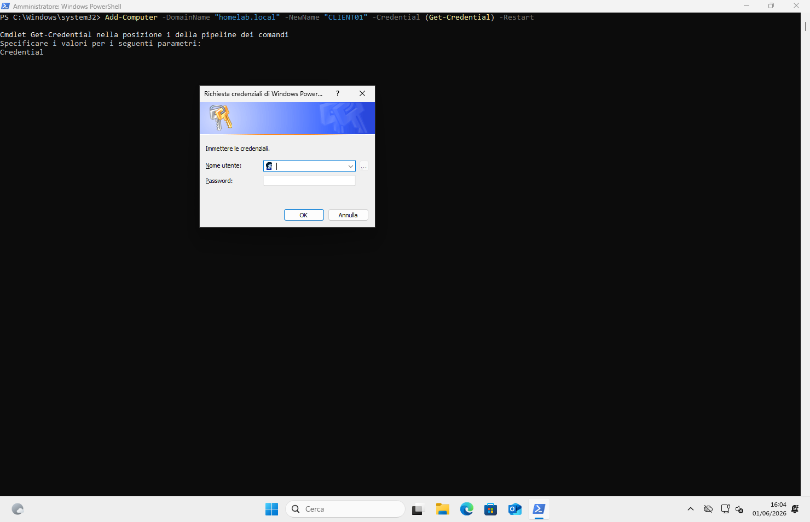
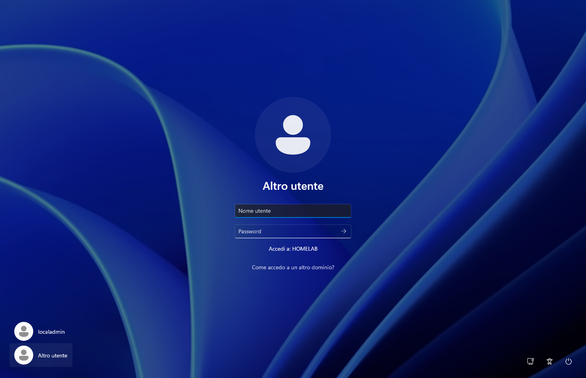
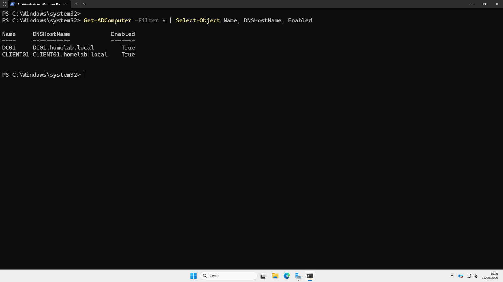
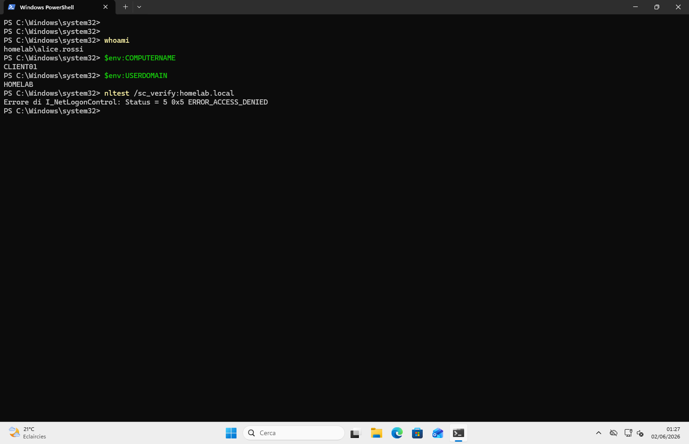

# 11 — CLIENT01: Windows 11 Domain Join

## Objective
Install Windows 11 Pro as the domain client workstation (CLIENT01),
join it to `homelab.local`, and verify domain authentication with a
standard user account. CLIENT01 is the realistic attack surface for
all Phase 4 Active Directory offensive exercises.

## VM Configuration

| Parameter   | Value                                |
| ----------- | ------------------------------------ |
| VMware name | CLIENT01                             |
| OS          | Windows 11 Pro                       |
| vCPU        | 2 cores                              |
| RAM         | 4096 MB                              |
| Disk        | 80 GB (single file)                  |
| Network     | VMnet2 (LAB — 10.10.10.0/24)         |
| Path        | `F:\VM\DISKS\CLIENT01\`              |
| TPM         | Virtual TPM (VMware auto-configured) |

## Local Account Created During Installation

| Field | Value |
|-------|-------|
| Username | localadmin |
| Password | Local@dmin1 |
| Security questions | all answered: "test" |

> **Note:** Screenshots not captured during OS installation phase.
> Base installation follows standard Windows 11 Pro setup using
> `oobe\bypassnro.cmd` to bypass Microsoft Account requirement.
> Documentation resumes from post-install network configuration.

---

## Step 1 — Network Configuration

Interface name verified with `Get-NetAdapter` → **Ethernet0**.

```powershell
# Set static IP
New-NetIPAddress -InterfaceAlias "Ethernet0" `
  -IPAddress "10.10.10.50" `
  -PrefixLength 24 `
  -DefaultGateway "10.10.10.254"

# DNS → must point to DC01, not pfSense
Set-DnsClientServerAddress -InterfaceAlias "Ethernet0" `
  -ServerAddresses "10.10.10.10", "10.10.10.254"
```



### Result — ipconfig /all

| Field | Value |
|-------|-------|
| Hostname | DESKTOP-M6L24EJ (pre-rename, before domain join) |
| IPv4 | 10.10.10.50 |
| Subnet mask | 255.255.255.0 |
| Default gateway | 10.10.10.254 |
| DNS servers | 10.10.10.10 / 10.10.10.254 |
| DHCP | No (static) |



> **Why DNS points to DC01 (10.10.10.10) and not pfSense:**
> Domain-joined machines must use the DC as DNS server to resolve
> AD SRV records (`_ldap._tcp.homelab.local`, `_kerberos._tcp.homelab.local`).
> Without this, domain join and authentication fail entirely.

---

## Step 2 — Connectivity Verification

All three tests must pass before attempting domain join:

```powershell
ping 10.10.10.254 -n 2   # pfSense gateway
ping 10.10.10.10 -n 2    # DC01 — critical
Resolve-DnsName homelab.local
```

| Test | Result |
|------|--------|
| ping pfSense (10.10.10.254) | ✅ 0% loss, <1ms |
| ping DC01 (10.10.10.10) | ✅ 0% loss, <1ms |
| Resolve-DnsName homelab.local | ✅ → 10.10.10.10 |



---

## Step 3 — Domain Join

Single command — renames the machine AND joins the domain simultaneously,
then reboots automatically.

```powershell
Add-Computer `
  -DomainName "homelab.local" `
  -NewName "CLIENT01" `
  -Credential (Get-Credential) `
  -Restart
```

Credentials entered in the dialog:

| Field | Value |
|-------|-------|
| Username | `HOMELAB\Administrator` |
| Password | `Adm1n!str4tor` |




---

## Step 4 — Login Screen Verification

After reboot, the Windows login screen shows:

```
Accedi a: HOMELAB
```

This confirms CLIENT01 successfully joined the domain. The domain name
(`HOMELAB`) is displayed because Windows found and authenticated with DC01.



---

## Step 5 — Verification from DC01

On DC01 (PowerShell as Administrator):

```powershell
Get-ADComputer -Filter * | Select-Object Name, DNSHostName, Enabled
```

```
Name      DNSHostName                Enabled
----      -----------                -------
DC01      DC01.homelab.local         True
CLIENT01  CLIENT01.homelab.local     True    ✅
```



---

## Step 6 — Domain User Login (alice.rossi)

First domain user login on CLIENT01:

| Field | Value |
|-------|-------|
| Username | `alice.rossi` |
| Password | `Password123!` |
| Domain | HOMELAB (shown in login screen) |

> First login takes ~30 seconds — Windows creates the local profile
> for the domain user. Subsequent logins are immediate.

### Verification from CLIENT01 as alice.rossi

```powershell
whoami
# homelab\alice.rossi  ✅

$env:COMPUTERNAME
# CLIENT01  ✅

$env:USERDOMAIN
# HOMELAB  ✅

nltest /sc_verify:homelab.local
# ERROR_ACCESS_DENIED  ← expected, see note below
```



> **Note on nltest ACCESS_DENIED:**
> `nltest /sc_verify` requires local administrator or domain admin
> privileges. `alice.rossi` is a standard domain user without local
> admin rights — this is correct and expected behavior.
> The successful `whoami` → `homelab\alice.rossi` already proves the
> domain secure channel is operational (Kerberos authentication
> succeeded to log in).

---

## Full Network Map — Post CLIENT01

| VM | IP | VMnet | Role |
|----|----|----|------|
| Host Windows | 192.168.233.1 | VMnet1 | Physical host |
| pfSense LAN | 192.168.233.254 | VMnet1 | Firewall mgmt |
| pfSense LAB | 10.10.10.254 | VMnet2 | Lab gateway |
| Kali Linux | 10.10.10.100 | VMnet2 | Attacker |
| Metasploitable2 | 10.10.10.101 | VMnet2 | Target |
| Ubuntu Server | 10.10.10.105 | VMnet2 | Blue Team / SIEM |
| Windows Server 2025 | 10.10.10.10 | VMnet2 | Domain Controller |
| **Windows 11** | **10.10.10.50** | **VMnet2** | **Domain Client** |

---

## Snapshots

| # | Name | State |
|---|------|-------|
| 00 | `00-client01-installed-pre-config` | OS installed, localadmin account |
| **01** ⭐ | **`01-client01-joined-domain-homelab`** | **Domain joined, alice.rossi verified** |

---

## Lessons Learned

- Windows 11 Pro requires TPM 2.0 — VMware Workstation Pro adds a
  virtual TPM automatically when Windows 11 is selected as guest OS
- The `oobe\bypassnro.cmd` trick (Shift+F10 during OOBE) is the
  cleanest method to avoid the Microsoft Account requirement
- DNS **must** point to DC01 before domain join — if it points to
  pfSense or 1.1.1.1, `Resolve-DnsName homelab.local` fails and
  `Add-Computer` returns a name resolution error
- `-NewName` in `Add-Computer` renames and joins simultaneously —
  no need for a separate `Rename-Computer` + reboot cycle
- `nltest /sc_verify` requires admin rights — a standard user
  getting ACCESS_DENIED is correct behavior, not an error
- First domain user login is slow (~30s) because Windows creates
  the roaming profile skeleton — all subsequent logins are fast

## Next Steps

- [ ] Install VMware Tools on CLIENT01
- [ ] BloodHound setup on Kali
- [ ] BloodHound data collection from CLIENT01/Kali
- [ ] Kerberoasting: GetUserSPNs.py against svc-sql and svc-backup
